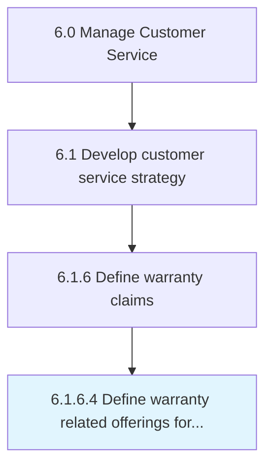

# Define warranty related offerings for customers

> Informing customers about warranties that apply to promoted products or services.

## Overview

Activity 6.1.6.4 is an activity within the Manage Customer Service framework. 

Informing customers about warranties that apply to promoted products or services.

## Process Hierarchy



## Key Statistics

| Metric | Value |
|--------|-------|
| APQC Code | 20091 |
| Hierarchy ID | 6.1.6.4 |
| Level | Activity |
| Parent | [6.1.6](../) |
| Sub-Processes | 0 |


## GraphDL Semantic Structure

```
define.WarrantyRelatedOfferings.for.Customers
```

| Component | Value | Description |
|-----------|-------|-------------|
| Verb | `define` | Primary action |
| Object | `warranty related offerings` | Direct object |
| Preposition | `for` | Relationship |
| PrepObject | `customers` | Indirect object |


## Related Concepts

- [WarrantyRelatedOfferings](/concepts/WarrantyRelatedOfferings)
- [Customers](/concepts/Customers)


---

*Source: APQC PCF 20091 (6.1.6.4) - APQC*
