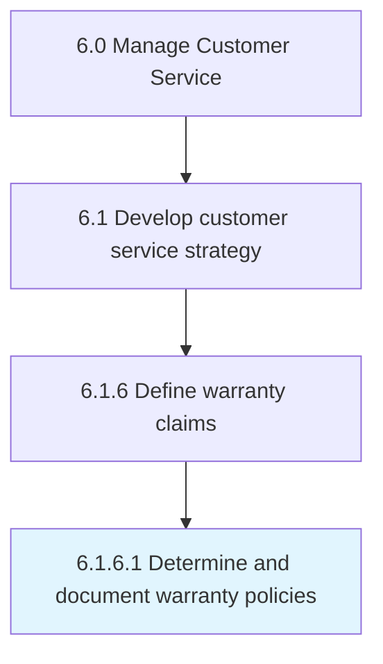

# Determine and document warranty policies

> Establishing warranty policies to assure customers that the company will guarantee its warranties that it issues.

## Overview

Activity 6.1.6.1 is an activity within the Manage Customer Service framework. 

Establishing warranty policies to assure customers that the company will guarantee its warranties that it issues.

## Process Hierarchy



## Key Statistics

| Metric | Value |
|--------|-------|
| APQC Code | 16893 |
| Hierarchy ID | 6.1.6.1 |
| Level | Activity |
| Parent | [6.1.6](../) |
| Sub-Processes | 0 |


## GraphDL Semantic Structure

```
determine.AndDocumentWarrantyPolicies
```

| Component | Value | Description |
|-----------|-------|-------------|
| Verb | `determine` | Primary action |
| Object | `and document warranty policies` | Direct object |


## Related Concepts

- [WarrantyPolicies](/concepts/WarrantyPolicies)
- [WarrantyPolicies](/concepts/WarrantyPolicies)


---

*Source: APQC PCF 16893 (6.1.6.1) - APQC*
