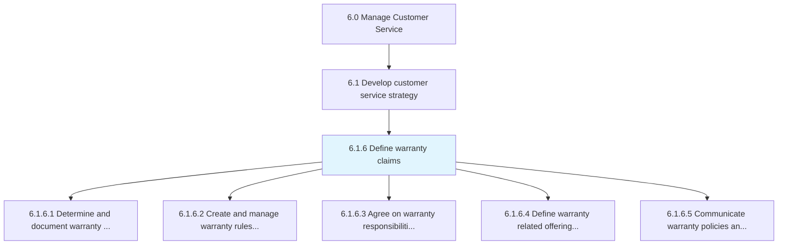
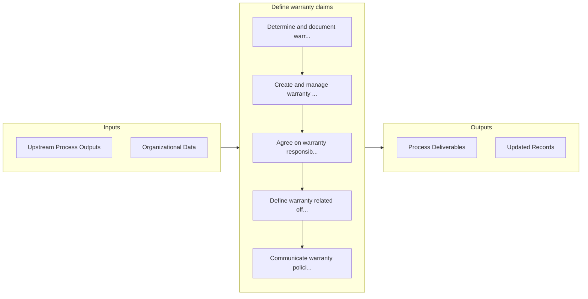

# Define warranty claims

> Determining the exact terms and conditions under which specific warranties apply to certain goods or services.

## Overview

Process 6.1.6 is a core process that defines the specific procedures for define warranty claims. 

Determining the exact terms and conditions under which specific warranties apply to certain goods or services.

## Process Hierarchy



## Key Statistics

| Metric | Value |
|--------|-------|
| APQC Code | 20089 |
| Hierarchy ID | 6.1.6 |
| Level | Process |
| Parent | [6.1](../) |
| Sub-Processes | 5 |


## GraphDL Semantic Structure

```
define.WarrantyClaims
```

| Component | Value | Description |
|-----------|-------|-------------|
| Verb | `define` | Primary action |
| Object | `warranty claims` | Direct object |


## Process Flow



## Sub-Processes

| Process | Hierarchy ID | Description |
|---------|-------------|-------------|
| [Determine and document warranty policies](./DetermineAndDocumentWarrantyPolicies) | 6.1.6.1 | Establishing warranty policies to assure customers that the company will guarantee its warranties th |
| [Create and manage warranty rules/claim codes for products](./CreateAndManageWarrantyRulesclaimCodesForProducts) | 6.1.6.2 | Establishing and maintaining claims processing and routing rules |
| [Agree on warranty responsibilities with suppliers](./AgreeOnWarrantyResponsibilitiesWithSuppliers) | 6.1.6.3 | Negotiating with manufacturers and dealers the obligations of each party in upholding warranties |
| [Define warranty related offerings for customers](./DefineWarrantyRelatedOfferingsForCustomers) | 6.1.6.4 | Informing customers about warranties that apply to promoted products or services |
| [Communicate warranty policies and offerings](./CommunicateWarrantyPoliciesAndOfferings) | 6.1.6.5 | Communicating rules and updates via training manuals for new products and training resources |


## Related Concepts

- WarrantyClaims


---

*Source: APQC PCF 20089 (6.1.6) - APQC*
