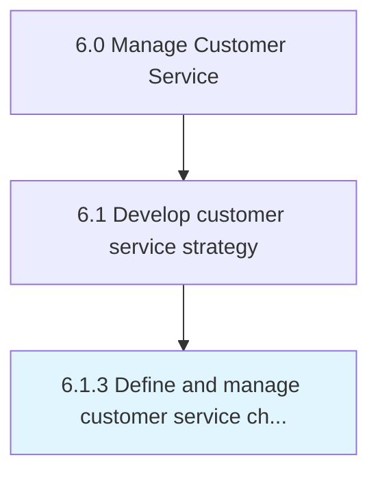

# Define and manage customer service channel strategy

> Establishing and refining procedures for customer service and technical support.

## Overview

Process 6.1.3 is a core process that defines the specific procedures for define and manage customer service channel strategy. 

Establishing and refining procedures for customer service and technical support.

## Process Hierarchy



## Key Statistics

| Metric | Value |
|--------|-------|
| APQC Code | 20088 |
| Hierarchy ID | 6.1.3 |
| Level | Process |
| Parent | [6.1](../) |
| Sub-Processes | 0 |


## GraphDL Semantic Structure

```
define.AndManageCustomerServiceChannelStrategy
```

| Component | Value | Description |
|-----------|-------|-------------|
| Verb | `define` | Primary action |
| Object | `and manage customer service channel strategy` | Direct object |


## Related Concepts

- CustomerServiceChannelStrategy
- CustomerServiceChannelStrategy


---

*Source: APQC PCF 20088 (6.1.3) - APQC*
