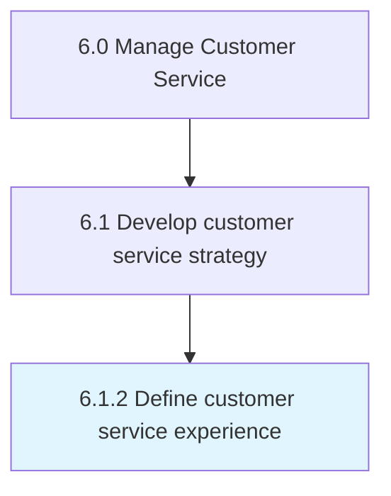

# Define customer service experience

> Communicating to the customer service resources what is expected when engaging the customer.

## Overview

Process 6.1.2 is a core process that defines the specific procedures for define customer service experience. 

Communicating to the customer service resources what is expected when engaging the customer. Relate service level expectations to the workforce. Ensure positive customer experience.

## Process Hierarchy



## Key Statistics

| Metric | Value |
|--------|-------|
| APQC Code | 20087 |
| Hierarchy ID | 6.1.2 |
| Level | Process |
| Parent | [6.1](../) |
| Sub-Processes | 0 |


## GraphDL Semantic Structure

```
define.CustomerServiceExperience
```

| Component | Value | Description |
|-----------|-------|-------------|
| Verb | `define` | Primary action |
| Object | `customer service experience` | Direct object |


## Related Concepts

- [CustomerServiceExperience](/concepts/CustomerServiceExperience)


---

*Source: APQC PCF 20087 (6.1.2) - APQC*
