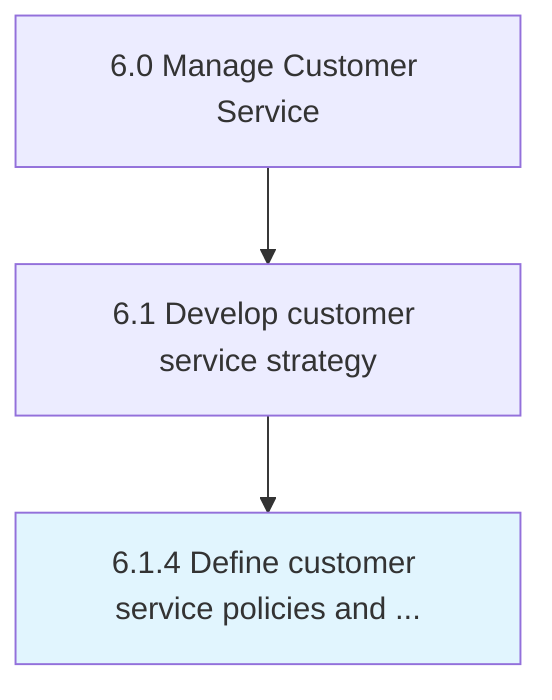

# Define customer service policies and procedures

> Outlining the framework of policies and methods for developing customer service strategy.

## Overview

Process 6.1.4 is a core process that defines the specific procedures for define customer service policies and procedures. 

Outlining the framework of policies and methods for developing customer service strategy. Establish the rules and regulations that serve as a guideline for the customer service strategy. Take into account customer needs and behavior.

## Process Hierarchy



## Key Statistics

| Metric | Value |
|--------|-------|
| APQC Code | 10382 |
| Hierarchy ID | 6.1.4 |
| Level | Process |
| Parent | [6.1](../) |
| Sub-Processes | 0 |


## GraphDL Semantic Structure

```
define.CustomerServicePoliciesAndProcedures
```

| Component | Value | Description |
|-----------|-------|-------------|
| Verb | `define` | Primary action |
| Object | `customer service policies and procedures` | Direct object |


## Related Concepts

- CustomerServicePolicies
- Procedures


---

*Source: APQC PCF 10382 (6.1.4) - APQC*
