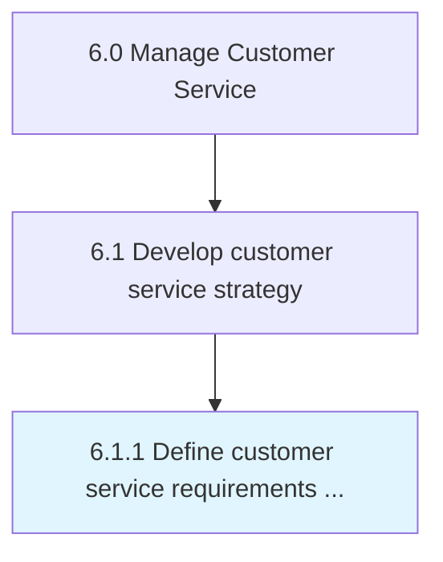

# Define customer service requirements across the enterprise

> Defining a set of behaviors, skills, and policies needed to provide customer service effectively across the enterprise.

## Overview

Process 6.1.1 is a core process that defines the specific procedures for define customer service requirements across the enterprise. 

Defining a set of behaviors, skills, and policies needed to provide customer service effectively across the enterprise.

## Process Hierarchy



## Key Statistics

| Metric | Value |
|--------|-------|
| APQC Code | 20086 |
| Hierarchy ID | 6.1.1 |
| Level | Process |
| Parent | [6.1](../) |
| Sub-Processes | 0 |


## GraphDL Semantic Structure

```
define.CustomerServiceRequirements.across.TheEnterprise
```

| Component | Value | Description |
|-----------|-------|-------------|
| Verb | `define` | Primary action |
| Object | `customer service requirements` | Direct object |
| Preposition | `across` | Relationship |
| PrepObject | `the enterprise` | Indirect object |


## Related Concepts

- [CustomerServiceRequirements](/concepts/CustomerServiceRequirements)
- [Enterprise](/concepts/Enterprise)


---

*Source: APQC PCF 20086 (6.1.1) - APQC*
