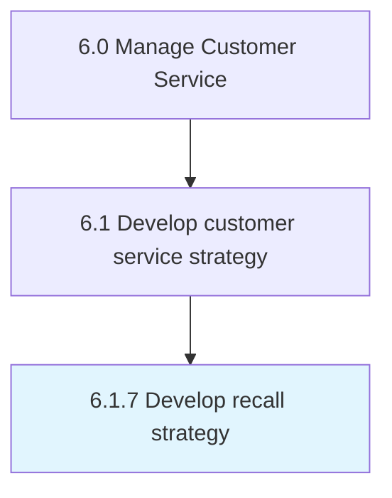

# Develop recall strategy

> Establishing procedures to handle recalls of defective products.

## Overview

Process 6.1.7 is a core process that defines the specific procedures for develop recall strategy. 

Establishing procedures to handle recalls of defective products.

## Process Hierarchy



## Key Statistics

| Metric | Value |
|--------|-------|
| APQC Code | 20092 |
| Hierarchy ID | 6.1.7 |
| Level | Process |
| Parent | [6.1](../) |
| Sub-Processes | 0 |


## GraphDL Semantic Structure

```
develop.RecallStrategy
```

| Component | Value | Description |
|-----------|-------|-------------|
| Verb | `develop` | Primary action |
| Object | `recall strategy` | Direct object |


## Related Concepts

- [RecallStrategy](/concepts/RecallStrategy)


---

*Source: APQC PCF 20092 (6.1.7) - APQC*
