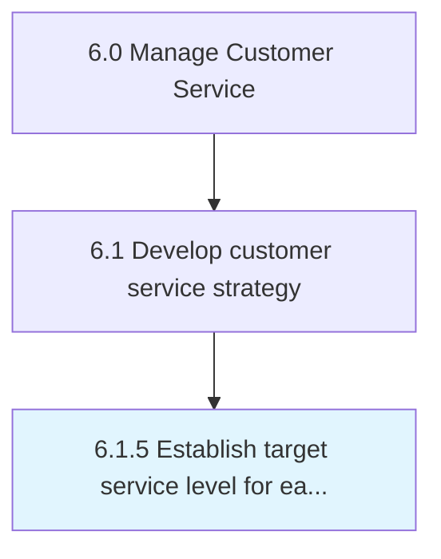

# Establish target service level for each customer segment

> Determining and implementing levels for customer services.

## Overview

Process 6.1.5 is a core process that defines the specific procedures for establish target service level for each customer segment. 

Determining and implementing levels for customer services. Benchmark certain customer service practices, and base customer level services on those benchmarks. Create a service level agreement, which is a negotiated agreement designed to create a common understanding about services, priorities, and responsibilities.

## Process Hierarchy



## Key Statistics

| Metric | Value |
|--------|-------|
| APQC Code | 10383 |
| Hierarchy ID | 6.1.5 |
| Level | Process |
| Parent | [6.1](../) |
| Sub-Processes | 0 |


## GraphDL Semantic Structure

```
establish.TargetServiceLevel.for.EachCustomerSegment
```

| Component | Value | Description |
|-----------|-------|-------------|
| Verb | `establish` | Primary action |
| Object | `target service level` | Direct object |
| Preposition | `for` | Relationship |
| PrepObject | `each customer segment` | Indirect object |


## Related Concepts

- TargetServiceLevel
- CustomerSegment


---

*Source: APQC PCF 10383 (6.1.5) - APQC*
