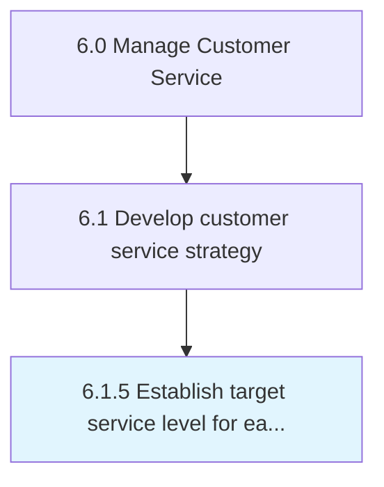
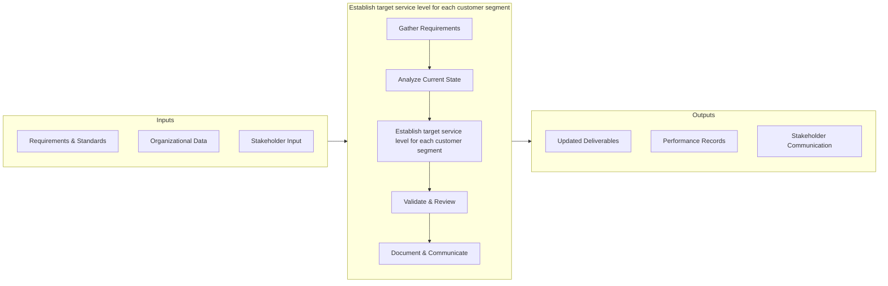

# Establish target service level for each customer segment

> Determining and implementing levels for customer services.

## Overview

This activity encompasses the end-to-end process of establish target service level for each customer segment within the customer service and support domain. It involves coordinating cross-functional teams, applying standardized methodologies, and leveraging organizational data to ensure consistent and effective outcomes. The process is aligned with the broader Manage Customer Service framework (APQC 6.1.5) and supports strategic objectives by translating operational requirements into actionable procedures.

Effective execution of this activity requires clear ownership, well-defined inputs and outputs, and continuous monitoring against established benchmarks. Organizations that excel at this process typically integrate it with upstream planning activities and downstream performance measurement, creating a feedback loop that drives ongoing improvement and adaptation to changing business conditions.


## Process Hierarchy



## Key Statistics

| Metric | Value |
|--------|-------|
| APQC Code | 10383 |
| Hierarchy ID | 6.1.5 |
| Level | Process |
| Parent | [6.1](../) |
| Sub-Processes | 0 |


## GraphDL Semantic Structure

```
establish.TargetServiceLevel.for.EachCustomerSegment
```

| Component | Value | Description |
|-----------|-------|-------------|
| Verb | `establish` | Primary action |
| Object | `target service level` | Direct object |
| Preposition | `for` | Relationship |
| PrepObject | `each customer segment` | Indirect object |


## Process Flow



## RACI Matrix

| Activity | Customer Service Manager | CX Director | Quality Assurance Team | IT Support |
|----------|:-:|:-:|:-:|:-:|
| Gather Requirements | R | A | C | I |
| Analyze Current State | R | I | C | I |
| Establish target service level for each customer segment | R | A | C | I |
| Validate & Review | C | A | R | I |
| Document & Communicate | R | I | I | C |

## Related Occupations

- [Customer Service Manager](/occupations/CustomerServiceManagers)
- [Contact Center Supervisor](/occupations/ContactCenterSupervisors)
- [Customer Experience Analyst](/occupations/CustomerExperienceAnalysts)
- [Technical Support Specialist](/occupations/TechnicalSupportSpecialists)

## Related Departments

- Customer Service & Support
- Customer Experience
- Quality Assurance

## Industry Variations

### Telecommunications
High-volume contact centers with emphasis on first-call resolution, churn prevention, and technical troubleshooting escalation paths.

### E-Commerce
Focus on self-service capabilities, returns management, and real-time chat support with AI-assisted triage.

### Banking & Financial Services
Emphasis on regulatory compliance in complaint handling, fraud resolution workflows, and omnichannel service delivery.

## KPIs & Metrics

| KPI | Description | Unit |
|-----|-------------|------|
| Cycle Time | Average time to complete establish target service level process | Hours/Days |
| Completion Rate | Percentage of target service level activities completed on schedule | % |
| Quality Score | Accuracy and quality rating of target service level outputs | 1-10 Scale |
| Cost Efficiency | Cost per unit of target service level processed | $/Unit |
| Customer Satisfaction (CSAT) | Customer rating of the target service level experience | 1-5 Scale |

## Related Concepts

- TargetServiceLevel
- CustomerSegment


---

*Source: APQC PCF 10383 (6.1.5) - APQC*
