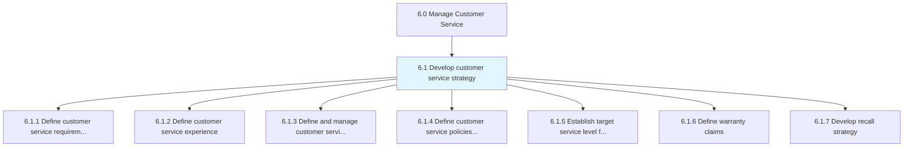
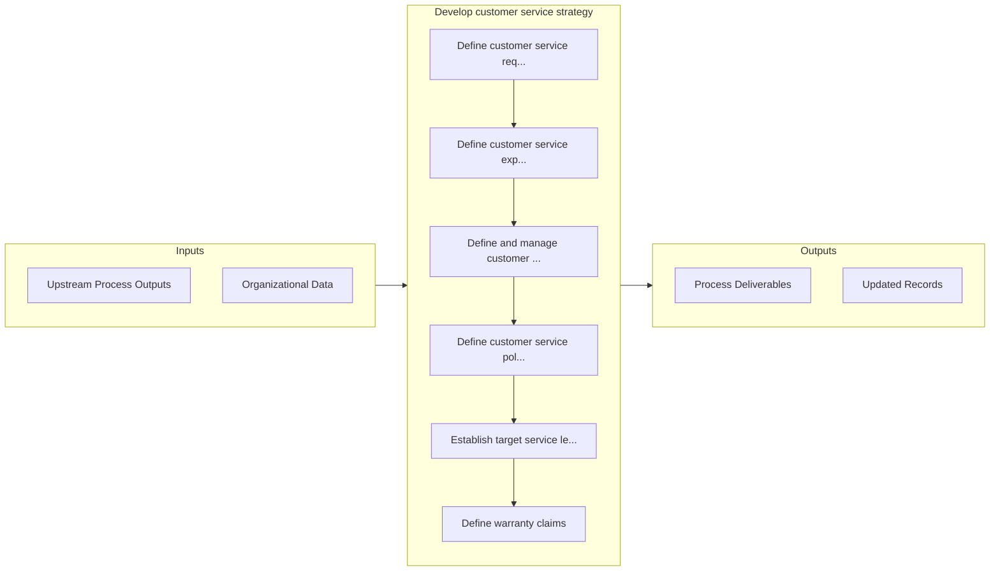

# Develop customer service strategy

> Defining a plan that removes customer obstacles by gathering operational insight and competitive insight, as well as improving soft skills and forward resolution for employees.

## Overview

Group 6.1 is a process group within APQC Category 6.0 (Manage Customer Service). 

Defining a plan that removes customer obstacles by gathering operational insight and competitive insight, as well as improving soft skills and forward resolution for employees. Develop customer segmentation. Define rules and regulations for customer service. Establish service levels for customers.

## Process Hierarchy



## Key Statistics

| Metric | Value |
|--------|-------|
| APQC Code | 10378 |
| Hierarchy ID | 6.1 |
| Level | Group |
| Parent | [6](../) |
| Sub-Processes | 7 |


## GraphDL Semantic Structure

```
develop.CustomerServiceStrategy
```

| Component | Value | Description |
|-----------|-------|-------------|
| Verb | `develop` | Primary action |
| Object | `customer service strategy` | Direct object |


## Process Flow



## Sub-Processes

| Process | Hierarchy ID | Description |
|---------|-------------|-------------|
| [Define customer service requirements across the enterprise](./DefineCustomerServiceRequirementsAcrossTheEnterprise) | 6.1.1 | Defining a set of behaviors, skills, and policies needed to provide customer service effectively acr |
| [Define customer service experience](./DefineCustomerServiceExperience) | 6.1.2 | Communicating to the customer service resources what is expected when engaging the customer |
| [Define and manage customer service channel strategy](./DefineAndManageCustomerServiceChannelStrategy) | 6.1.3 | Establishing and refining procedures for customer service and technical support |
| [Define customer service policies and procedures](./DefineCustomerServicePoliciesAndProcedures) | 6.1.4 | Outlining the framework of policies and methods for developing customer service strategy |
| [Establish target service level for each customer segment](./EstablishTargetServiceLevelForEachCustomerSegment) | 6.1.5 | Determining and implementing levels for customer services |
| [Define warranty claims](./6.1.6-DefineWarrantyClaims/) | 6.1.6 | Determining the exact terms and conditions under which specific warranties apply to certain goods or |
| [Develop recall strategy](./DevelopRecallStrategy) | 6.1.7 | Establishing procedures to handle recalls of defective products |


## Related Concepts

- CustomerServiceStrategy


---

*Source: APQC PCF 10378 (6.1) - APQC*
