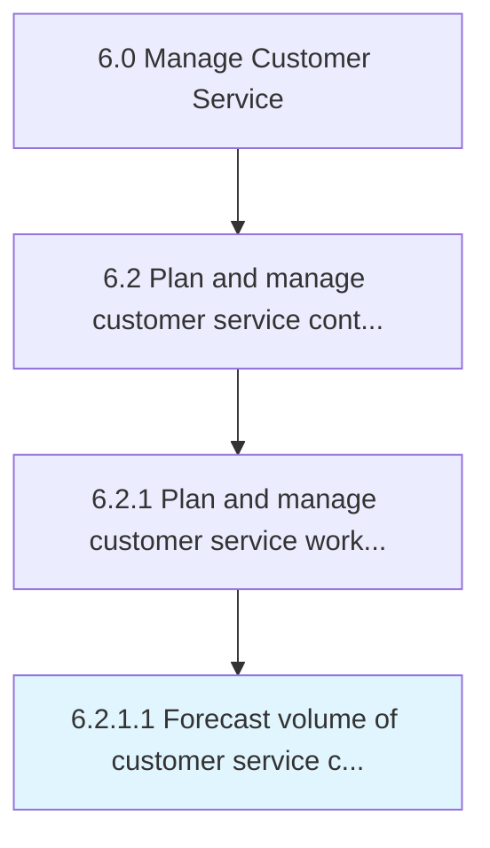

# Forecast volume of customer service contacts

> Projecting the total work force required to service customer service inquiries in order to effectively predict the volume of vendor contracts required.

## Overview

Activity 6.2.1.1 is an activity within the Manage Customer Service framework. 

Projecting the total work force required to service customer service inquiries in order to effectively predict the volume of vendor contracts required. Estimate the number of the customer service contracts in an agreed-upon time frame in order to strategically maintain the work force necessitated for customer inquires. Analyze historical data around customer service contracts, the universe of customer inquiries, frequency of inquiries, servicing capability (per head) of the employees, etc.

## Process Hierarchy



## Key Statistics

| Metric | Value |
|--------|-------|
| APQC Code | 10390 |
| Hierarchy ID | 6.2.1.1 |
| Level | Activity |
| Parent | [6.2.1](../) |
| Sub-Processes | 0 |


## GraphDL Semantic Structure

```
forecast.Volume.of.CustomerServiceContacts
```

| Component | Value | Description |
|-----------|-------|-------------|
| Verb | `forecast` | Primary action |
| Object | `volume` | Direct object |
| Preposition | `of` | Relationship |
| PrepObject | `customer service contacts` | Indirect object |


## Related Concepts

- [Volume](/concepts/Volume)
- [CustomerServiceContacts](/concepts/CustomerServiceContacts)


---

*Source: APQC PCF 10390 (6.2.1.1) - APQC*
