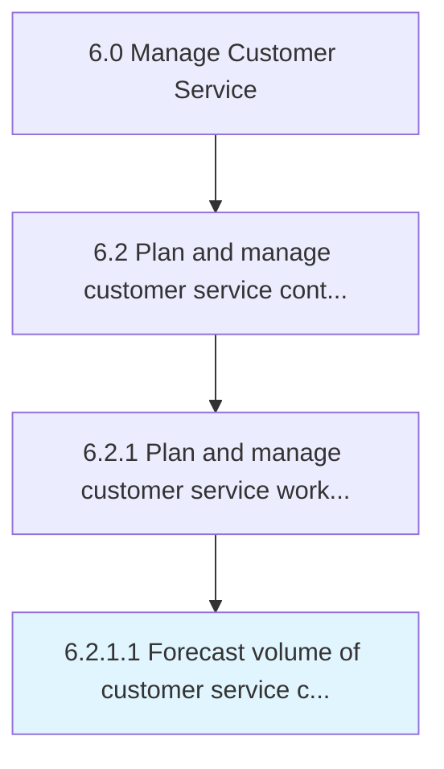
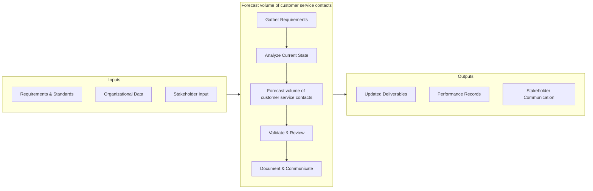
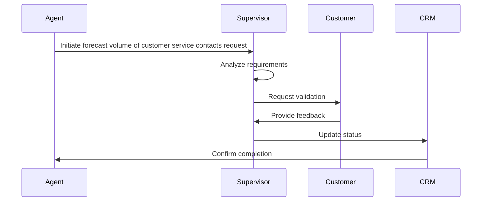

# Forecast volume of customer service contacts

> Projecting the total work force required to service customer service inquiries in order to effectively predict the volume of vendor contracts required.

## Overview

Activity 6.2.1.1 is an activity within the Manage Customer Service framework. 

Projecting the total work force required to service customer service inquiries in order to effectively predict the volume of vendor contracts required. Estimate the number of the customer service contracts in an agreed-upon time frame in order to strategically maintain the work force necessitated for customer inquires. Analyze historical data around customer service contracts, the universe of customer inquiries, frequency of inquiries, servicing capability (per head) of the employees, etc.

## Process Hierarchy



## Key Statistics

| Metric | Value |
|--------|-------|
| APQC Code | 10390 |
| Hierarchy ID | 6.2.1.1 |
| Level | Activity |
| Parent | [6.2.1](../) |
| Sub-Processes | 0 |


## GraphDL Semantic Structure

```graphdl
forecast.Volume.of.CustomerServiceContacts
```

| Component | Value | Description |
|-----------|-------|-------------|
| Verb | `forecast` | Primary action |
| Object | `volume` | Direct object |
| Preposition | `of` | Relationship |
| PrepObject | `customer service contacts` | Indirect object |


## Process Flow




## Process Sequence


## RACI Matrix

| Activity | Customer Service Manager | CX Director | Quality Assurance Team | IT Support |
|----------|:-:|:-:|:-:|:-:|
| Gather Requirements | R | A | C | I |
| Analyze Current State | R | I | C | I |
| Forecast volume of customer service contacts | R | A | C | I |
| Validate & Review | C | A | R | I |
| Document & Communicate | R | I | I | C |

## Related Occupations

- [Customer Service Manager](/occupations/CustomerServiceManagers)
- [Contact Center Supervisor](/occupations/ContactCenterSupervisors)
- [Customer Experience Analyst](/occupations/CustomerExperienceAnalysts)
- [Technical Support Specialist](/occupations/TechnicalSupportSpecialists)

## Related Departments

- Customer Service & Support
- Customer Experience
- Quality Assurance

## Industry Variations

### Telecommunications
High-volume contact centers with emphasis on first-call resolution, churn prevention, and technical troubleshooting escalation paths.

### E-Commerce
Focus on self-service capabilities, returns management, and real-time chat support with AI-assisted triage.

### Banking & Financial Services
Emphasis on regulatory compliance in complaint handling, fraud resolution workflows, and omnichannel service delivery.

## KPIs & Metrics

| KPI | Description | Unit |
|-----|-------------|------|
| Cycle Time | Average time to complete forecast volume process | Hours/Days |
| Completion Rate | Percentage of volume activities completed on schedule | % |
| Quality Score | Accuracy and quality rating of volume outputs | 1-10 Scale |
| Cost Efficiency | Cost per unit of volume processed | $/Unit |
| Customer Satisfaction (CSAT) | Customer rating of the volume experience | 1-5 Scale |

## Related Concepts

- Volume
- CustomerServiceContacts


---

*Source: APQC PCF 10390 (6.2.1.1) - APQC*
