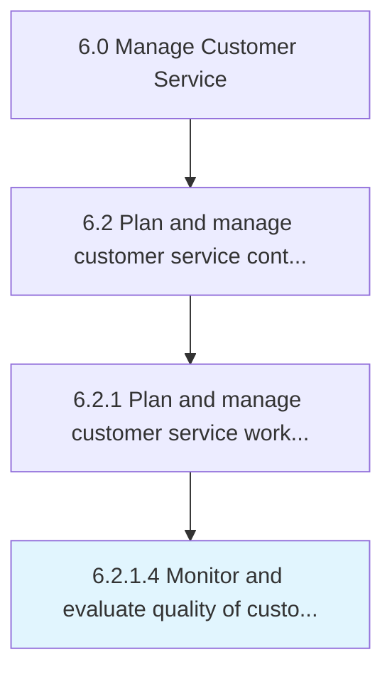

# Monitor and evaluate quality of customer interactions with customer service representatives

> Tracking and determining the quality of interactions between the customer and customer representatives.

## Overview

Activity 6.2.1.4 is an activity within the Manage Customer Service framework. 

Tracking and determining the quality of interactions between the customer and customer representatives. Use electronic devices to record and effectively assess customer representatives' interactions.

## Process Hierarchy



## Key Statistics

| Metric | Value |
|--------|-------|
| APQC Code | 10393 |
| Hierarchy ID | 6.2.1.4 |
| Level | Activity |
| Parent | [6.2.1](../) |
| Sub-Processes | 0 |


## GraphDL Semantic Structure

```
monitor.AndEvaluateQuality.of.CustomerInteractionsWithCustomerServiceRepresentatives
```

| Component | Value | Description |
|-----------|-------|-------------|
| Verb | `monitor` | Primary action |
| Object | `and evaluate quality` | Direct object |
| Preposition | `of` | Relationship |
| PrepObject | `customer interactions with customer service representatives` | Indirect object |


## Related Concepts

- [Quality](/concepts/Quality)
- [CustomerInteractionsWithCustomerServiceRepresentatives](/concepts/CustomerInteractionsWithCustomerServiceRepresentatives)
- [Quality](/concepts/Quality)
- [CustomerInteractionsWithCustomerServiceRepresentatives](/concepts/CustomerInteractionsWithCustomerServiceRepresentatives)


---

*Source: APQC PCF 10393 (6.2.1.4) - APQC*
