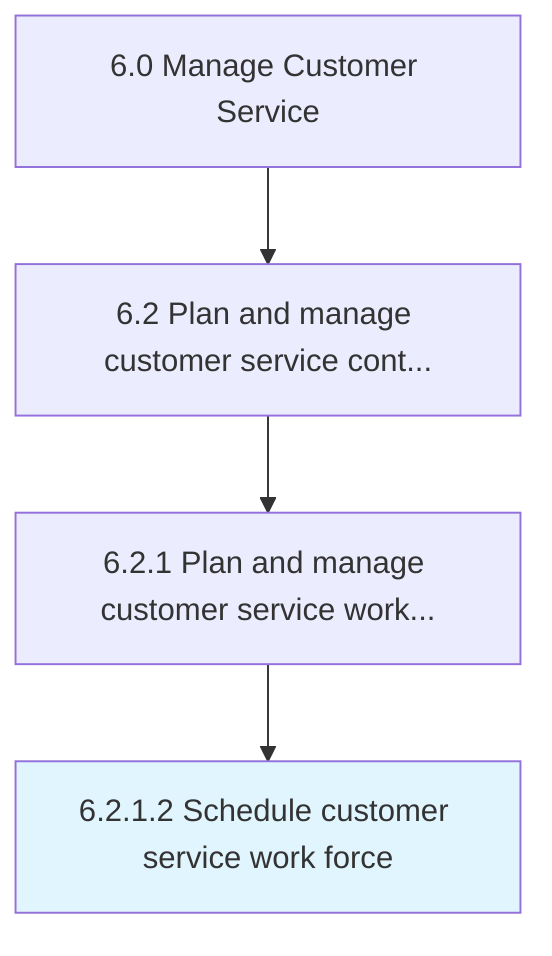

# Schedule customer service work force

> Deploying the work force to manage customer service contracts.

## Overview

Activity 6.2.1.2 is an activity within the Manage Customer Service framework. 

Deploying the work force to manage customer service contracts. Create a systematic summary of the operations and service required, as well as the specific amount of work force that is to be deployed to the customer service operations. Ensure work force is directly proportional to the estimated forecast of customer service contracts.

## Process Hierarchy



## Key Statistics

| Metric | Value |
|--------|-------|
| APQC Code | 10391 |
| Hierarchy ID | 6.2.1.2 |
| Level | Activity |
| Parent | [6.2.1](../) |
| Sub-Processes | 0 |


## GraphDL Semantic Structure

```
schedule.CustomerServiceWorkForce
```

| Component | Value | Description |
|-----------|-------|-------------|
| Verb | `schedule` | Primary action |
| Object | `customer service work force` | Direct object |


## Related Concepts

- CustomerServiceWorkForce


---

*Source: APQC PCF 10391 (6.2.1.2) - APQC*
