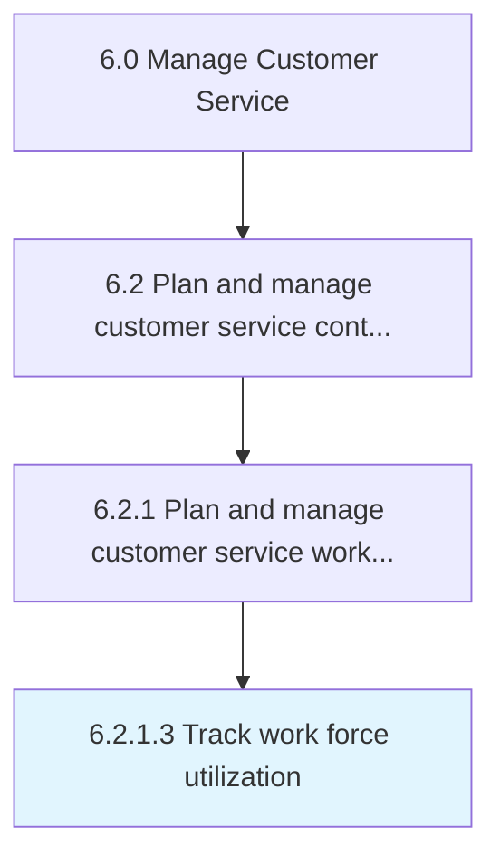

# Track work force utilization

> Tracking the utilization of work force deployed for managing customer service operations.

## Overview

Activity 6.2.1.3 is an activity within the Manage Customer Service framework. 

Tracking the utilization of work force deployed for managing customer service operations. Monitor the utility of the work force deployed for managing customer service operations in order to evaluate its efficiency and cost effectiveness. Calculate the overall labor effectiveness, which measures the utility, performance, and quality of the work force.

## Process Hierarchy



## Key Statistics

| Metric | Value |
|--------|-------|
| APQC Code | 10392 |
| Hierarchy ID | 6.2.1.3 |
| Level | Activity |
| Parent | [6.2.1](../) |
| Sub-Processes | 0 |


## GraphDL Semantic Structure

```
track.WorkForceUtilization
```

| Component | Value | Description |
|-----------|-------|-------------|
| Verb | `track` | Primary action |
| Object | `work force utilization` | Direct object |


## Related Concepts

- [WorkForceUtilization](/concepts/WorkForceUtilization)


---

*Source: APQC PCF 10392 (6.2.1.3) - APQC*
