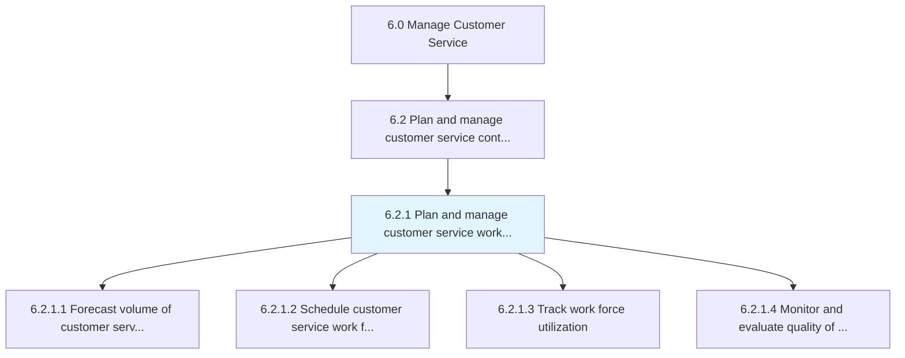
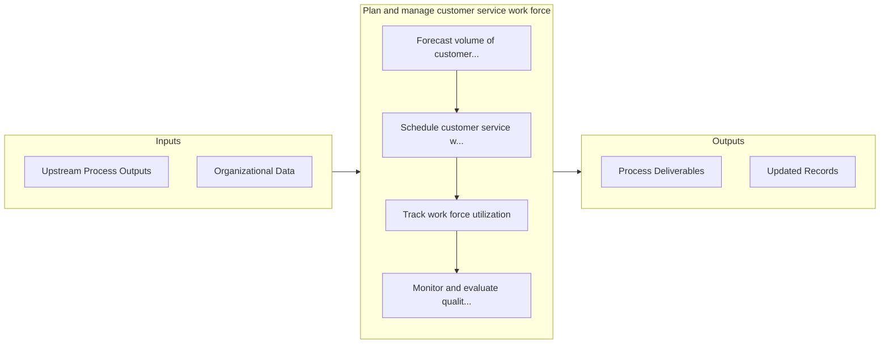

# Plan and manage customer service work force

> Creating and administering the work force deployed for the customer service process.

## Overview

Process 6.2.1 is a core process that defines the specific procedures for plan and manage customer service work force. 

Creating and administering the work force deployed for the customer service process. Forecast the customer work force needs to correctly schedule the work force. Track the utility of the work force deployed. Examine the interactions between the customer and customer service representatives to achieve high quality.

## Process Hierarchy



## Key Statistics

| Metric | Value |
|--------|-------|
| APQC Code | 10387 |
| Hierarchy ID | 6.2.1 |
| Level | Process |
| Parent | [6.2](../) |
| Sub-Processes | 4 |


## GraphDL Semantic Structure

```
plan.AndManageCustomerServiceWorkForce
```

| Component | Value | Description |
|-----------|-------|-------------|
| Verb | `plan` | Primary action |
| Object | `and manage customer service work force` | Direct object |


## Process Flow



## Sub-Processes

| Process | Hierarchy ID | Description |
|---------|-------------|-------------|
| [Forecast volume of customer service contacts](./ForecastVolumeOfCustomerServiceContacts) | 6.2.1.1 | Projecting the total work force required to service customer service inquiries in order to effective |
| [Schedule customer service work force](./ScheduleCustomerServiceWorkForce) | 6.2.1.2 | Deploying the work force to manage customer service contracts |
| [Track work force utilization](./TrackWorkForceUtilization) | 6.2.1.3 | Tracking the utilization of work force deployed for managing customer service operations |
| [Monitor and evaluate quality of customer interactions with customer service representatives](./MonitorAndEvaluateQualityOfCustomerInteractionsWithCustomerServiceRepresentatives) | 6.2.1.4 | Tracking and determining the quality of interactions between the customer and customer representativ |


## Related Concepts

- [CustomerServiceWorkForce](/concepts/CustomerServiceWorkForce)
- [CustomerServiceWorkForce](/concepts/CustomerServiceWorkForce)


---

*Source: APQC PCF 10387 (6.2.1) - APQC*
