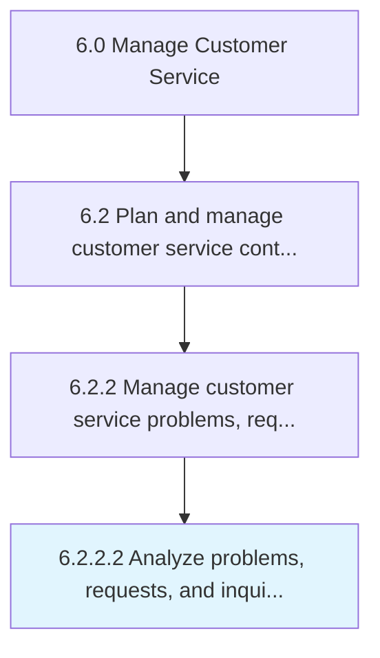

# Analyze problems, requests, and inquiries

> Analyzing various requests and inquiries from customers regarding products/services.

## Overview

Activity 6.2.2.2 is an activity within the Manage Customer Service framework. 

Analyzing various requests and inquiries from customers regarding products/services. Provide answers and offerings to satisfy the customer's needs.

## Process Hierarchy



## Key Statistics

| Metric | Value |
|--------|-------|
| APQC Code | 13482 |
| Hierarchy ID | 6.2.2.2 |
| Level | Activity |
| Parent | [6.2.2](../) |
| Sub-Processes | 0 |


## GraphDL Semantic Structure

```
analyze.ProblemsRequestsAndInquiries
```

| Component | Value | Description |
|-----------|-------|-------------|
| Verb | `analyze` | Primary action |
| Object | `problems, requests, and inquiries` | Direct object |


## Related Concepts

- [Problems](/concepts/Problems)
- [Requests](/concepts/Requests)
- [Inquiries](/concepts/Inquiries)


---

*Source: APQC PCF 13482 (6.2.2.2) - APQC*
