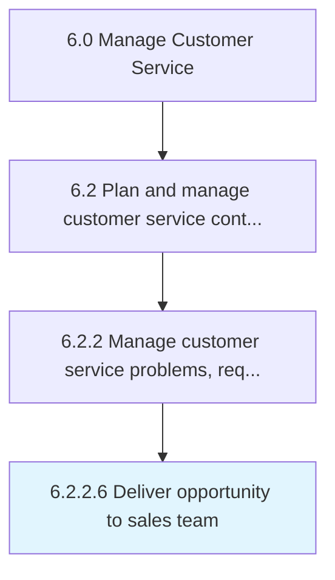

# Deliver opportunity to sales team

> Providing possible sales leads to the sales team in an effort to garner more business opportunities.

## Overview

Activity 6.2.2.6 is an activity within the Manage Customer Service framework. 

Providing possible sales leads to the sales team in an effort to garner more business opportunities.

## Process Hierarchy



## Key Statistics

| Metric | Value |
|--------|-------|
| APQC Code | 16937 |
| Hierarchy ID | 6.2.2.6 |
| Level | Activity |
| Parent | [6.2.2](../) |
| Sub-Processes | 0 |


## GraphDL Semantic Structure

```
deliver.Opportunity.to.SalesTeam
```

| Component | Value | Description |
|-----------|-------|-------------|
| Verb | `deliver` | Primary action |
| Object | `opportunity` | Direct object |
| Preposition | `to` | Relationship |
| PrepObject | `sales team` | Indirect object |


## Related Concepts

- Opportunity
- SalesTeam


---

*Source: APQC PCF 16937 (6.2.2.6) - APQC*
