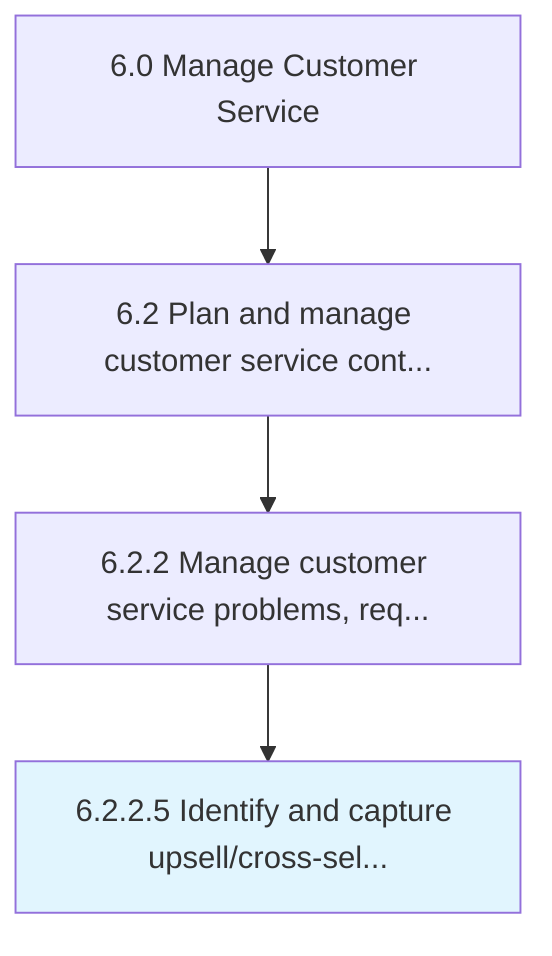

# Identify and capture upsell/cross-sell opportunities

> Utilizing customer inquiries as opportunities to either provide a comparable service to the one in question, offer additional complimentary service, or suggest a service that is better than what was initially offered.

## Overview

Activity 6.2.2.5 is an activity within the Manage Customer Service framework. 

Utilizing customer inquiries as opportunities to either provide a comparable service to the one in question, offer additional complimentary service, or suggest a service that is better than what was initially offered.

## Process Hierarchy



## Key Statistics

| Metric | Value |
|--------|-------|
| APQC Code | 16928 |
| Hierarchy ID | 6.2.2.5 |
| Level | Activity |
| Parent | [6.2.2](../) |
| Sub-Processes | 0 |


## GraphDL Semantic Structure

```
identify.AndCaptureUpsellcrosssellOpportunities
```

| Component | Value | Description |
|-----------|-------|-------------|
| Verb | `identify` | Primary action |
| Object | `and capture upsell/cross-sell opportunities` | Direct object |


---

*Source: APQC PCF 16928 (6.2.2.5) - APQC*
