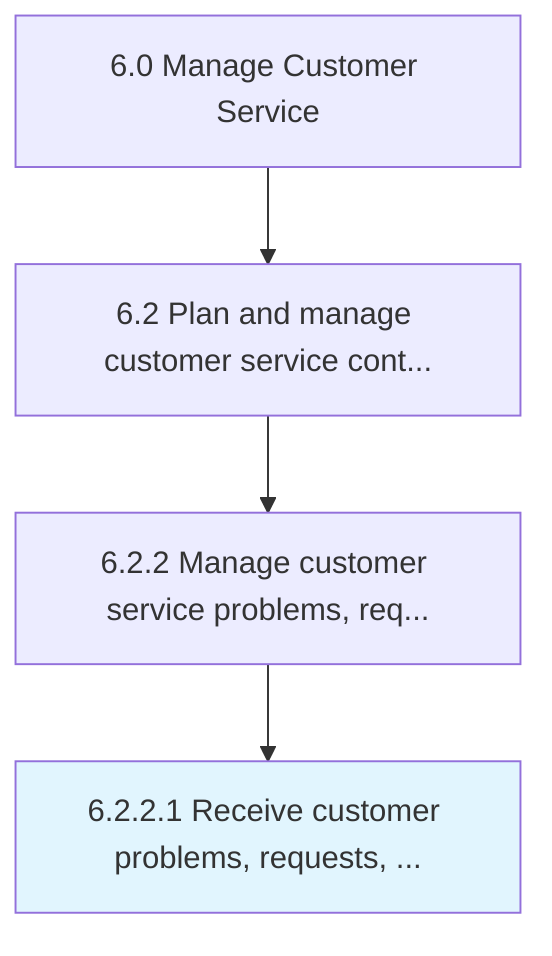

# Receive customer problems, requests, and inquiries

> Receiving requests for information from customers over multiple channels.

## Overview

Activity 6.2.2.1 is an activity within the Manage Customer Service framework. 

Receiving requests for information from customers over multiple channels. Receive various requests and inquiries from customers regarding products/services. Accept these inquiries through channels such as email, telephone, online forms, text messages, social media, and in person. Supply dedicated equipment, systems, and personnel.

## Process Hierarchy



## Key Statistics

| Metric | Value |
|--------|-------|
| APQC Code | 10394 |
| Hierarchy ID | 6.2.2.1 |
| Level | Activity |
| Parent | [6.2.2](../) |
| Sub-Processes | 0 |


## GraphDL Semantic Structure

```
receive.CustomerProblemsRequestsAndInquiries
```

| Component | Value | Description |
|-----------|-------|-------------|
| Verb | `receive` | Primary action |
| Object | `customer problems, requests, and inquiries` | Direct object |


## Related Concepts

- [CustomerProblems](/concepts/CustomerProblems)
- [Requests](/concepts/Requests)
- [Inquiries](/concepts/Inquiries)


---

*Source: APQC PCF 10394 (6.2.2.1) - APQC*
