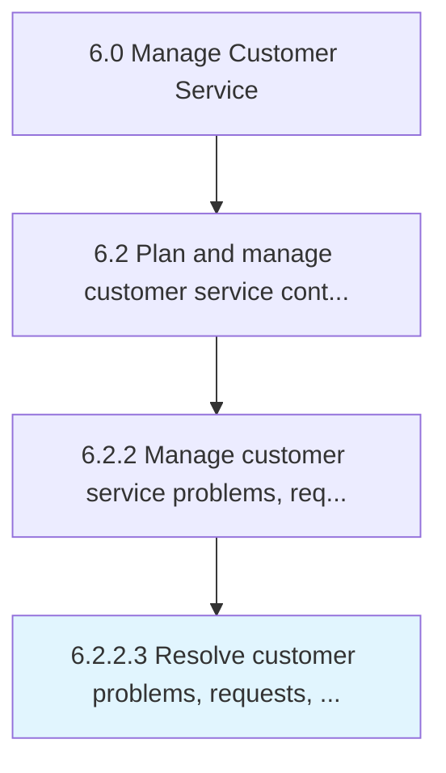

# Resolve customer problems, requests, and inquiries

> Routing customer inquiries in order to service them with the most apposite response.

## Overview

Activity 6.2.2.3 is an activity within the Manage Customer Service framework. 

Routing customer inquiries in order to service them with the most apposite response. Direct customer inquires to the best suited personnel or system. Have a system or procedure capable of efficiently channeling these requests.

## Process Hierarchy



## Key Statistics

| Metric | Value |
|--------|-------|
| APQC Code | 10395 |
| Hierarchy ID | 6.2.2.3 |
| Level | Activity |
| Parent | [6.2.2](../) |
| Sub-Processes | 0 |


## GraphDL Semantic Structure

```
resolve.CustomerProblemsRequestsAndInquiries
```

| Component | Value | Description |
|-----------|-------|-------------|
| Verb | `resolve` | Primary action |
| Object | `customer problems, requests, and inquiries` | Direct object |


## Related Concepts

- CustomerProblems
- Requests
- Inquiries


---

*Source: APQC PCF 10395 (6.2.2.3) - APQC*
