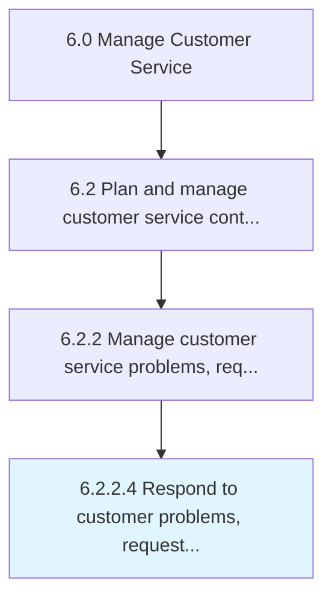

# Respond to customer problems, requests, and inquiries

> Responding to customer requests by email, conversation, interactive voice response, mail, etc.

## Overview

Activity 6.2.2.4 is an activity within the Manage Customer Service framework. 

Responding to customer requests by email, conversation, interactive voice response, mail, etc. with the most appropriate reply. Instill a robust process to locate the right information for a solution to a customer's problem.

## Process Hierarchy



## Key Statistics

| Metric | Value |
|--------|-------|
| APQC Code | 10396 |
| Hierarchy ID | 6.2.2.4 |
| Level | Activity |
| Parent | [6.2.2](../) |
| Sub-Processes | 0 |


## GraphDL Semantic Structure

```
respond.ToCustomerProblemsRequestsAndInquiries
```

| Component | Value | Description |
|-----------|-------|-------------|
| Verb | `respond` | Primary action |
| Object | `to customer problems, requests, and inquiries` | Direct object |


## Related Concepts

- [CustomerProblems](/concepts/CustomerProblems)
- [Requests](/concepts/Requests)
- [Inquiries](/concepts/Inquiries)


---

*Source: APQC PCF 10396 (6.2.2.4) - APQC*
