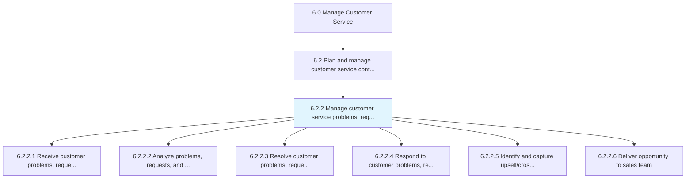
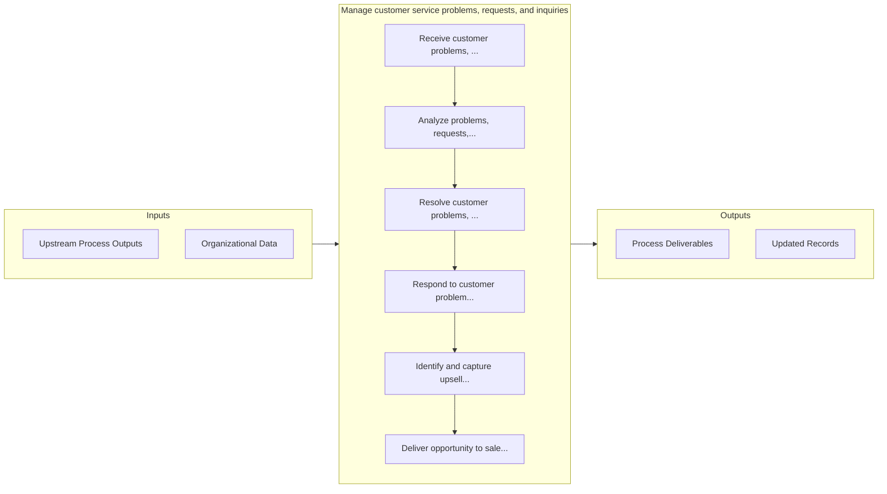

# Manage customer service problems, requests, and inquiries

> Handling the requests and inquiries from customers that seek information regarding the organization's products/services.

## Overview

Process 6.2.2 is a core process that defines the specific procedures for manage customer service problems, requests, and inquiries. 

Handling the requests and inquiries from customers that seek information regarding the organization's products/services. Obtain the customer requests online and by phone. Direct these requests to higher-level representatives. Approve requests, and respond to customers.

## Process Hierarchy



## Key Statistics

| Metric | Value |
|--------|-------|
| APQC Code | 10388 |
| Hierarchy ID | 6.2.2 |
| Level | Process |
| Parent | [6.2](../) |
| Sub-Processes | 6 |


## GraphDL Semantic Structure

```
manage.CustomerServiceProblemsRequestsAndInquiries
```

| Component | Value | Description |
|-----------|-------|-------------|
| Verb | `manage` | Primary action |
| Object | `customer service problems, requests, and inquiries` | Direct object |


## Process Flow



## Sub-Processes

| Process | Hierarchy ID | Description |
|---------|-------------|-------------|
| [Receive customer problems, requests, and inquiries](./ReceiveCustomerProblemsRequestsAndInquiries) | 6.2.2.1 | Receiving requests for information from customers over multiple channels |
| [Analyze problems, requests, and inquiries](./AnalyzeProblemsRequestsAndInquiries) | 6.2.2.2 | Analyzing various requests and inquiries from customers regarding products/services |
| [Resolve customer problems, requests, and inquiries](./ResolveCustomerProblemsRequestsAndInquiries) | 6.2.2.3 | Routing customer inquiries in order to service them with the most apposite response |
| [Respond to customer problems, requests, and inquiries](./RespondToCustomerProblemsRequestsAndInquiries) | 6.2.2.4 | Responding to customer requests by email, conversation, interactive voice response, mail, etc |
| [Identify and capture upsell/cross-sell opportunities](./IdentifyAndCaptureUpsellcrosssellOpportunities) | 6.2.2.5 | Utilizing customer inquiries as opportunities to either provide a comparable service to the one in q |
| [Deliver opportunity to sales team](./DeliverOpportunityToSalesTeam) | 6.2.2.6 | Providing possible sales leads to the sales team in an effort to garner more business opportunities |


## Related Concepts

- CustomerServiceProblems
- Requests
- Inquiries


---

*Source: APQC PCF 10388 (6.2.2) - APQC*
