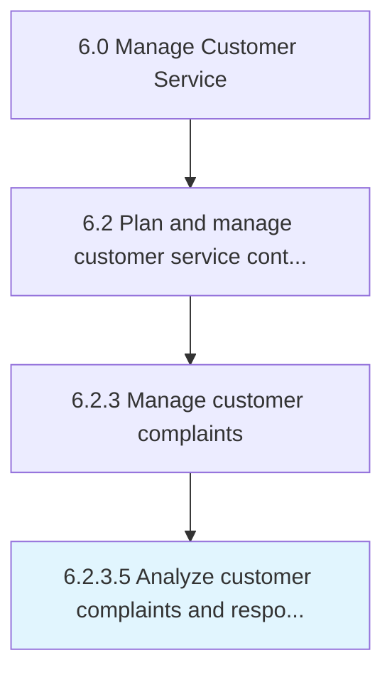

# Analyze customer complaints and response/redressal

> Analyzing complaint logs to provide input for continuous service improvement and customer profiling.

## Overview

Activity 6.2.3.5 is an activity within the Manage Customer Service framework. 

Analyzing complaint logs to provide input for continuous service improvement and customer profiling.

## Process Hierarchy



## Key Statistics

| Metric | Value |
|--------|-------|
| APQC Code | 19072 |
| Hierarchy ID | 6.2.3.5 |
| Level | Activity |
| Parent | [6.2.3](../) |
| Sub-Processes | 0 |


## GraphDL Semantic Structure

```
analyze.CustomerComplaintsAndResponseredressal
```

| Component | Value | Description |
|-----------|-------|-------------|
| Verb | `analyze` | Primary action |
| Object | `customer complaints and response/redressal` | Direct object |


## Related Concepts

- CustomerComplaints
- Response
- Redressal


---

*Source: APQC PCF 19072 (6.2.3.5) - APQC*
