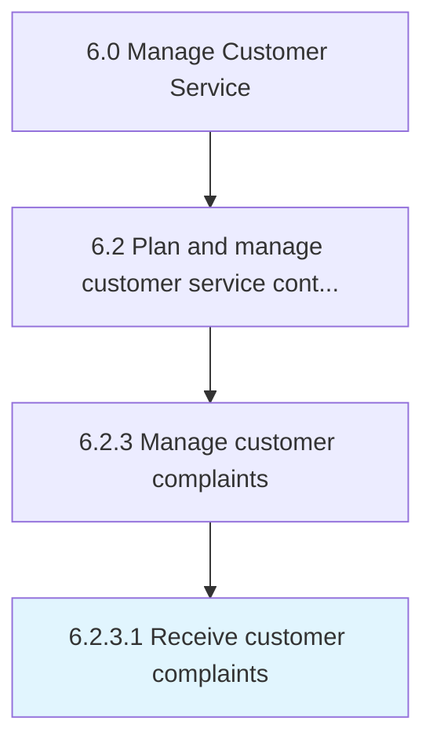

# Receive customer complaints

> Receiving any complaints or grievances from customers for the organization's products/services.

## Overview

Activity 6.2.3.1 is an activity within the Manage Customer Service framework. 

Receiving any complaints or grievances from customers for the organization's products/services. Receive objections, complaints, and criticism from customers regarding products/services through email, telephone, online forms, text messages, social media, in person, etc. Dedicate equipment, systems, and personnel.

## Process Hierarchy



## Key Statistics

| Metric | Value |
|--------|-------|
| APQC Code | 10397 |
| Hierarchy ID | 6.2.3.1 |
| Level | Activity |
| Parent | [6.2.3](../) |
| Sub-Processes | 0 |


## GraphDL Semantic Structure

```
receive.CustomerComplaints
```

| Component | Value | Description |
|-----------|-------|-------------|
| Verb | `receive` | Primary action |
| Object | `customer complaints` | Direct object |


## Related Concepts

- [CustomerComplaints](/concepts/CustomerComplaints)


---

*Source: APQC PCF 10397 (6.2.3.1) - APQC*
