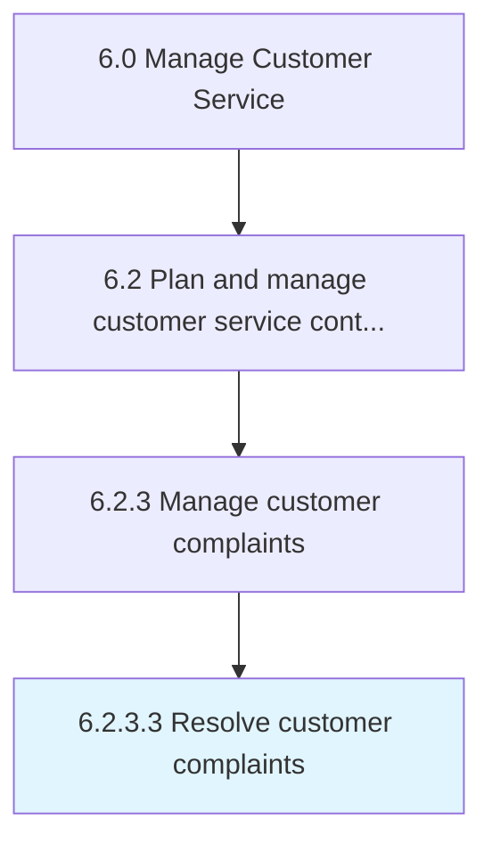

# Resolve customer complaints

> Resolving any customer complaints that are deemed to be sound and reasonable.

## Overview

Activity 6.2.3.3 is an activity within the Manage Customer Service framework. 

Resolving any customer complaints that are deemed to be sound and reasonable. Redress any objections, grievances, and complaints received from customers regarding the offerings provided by the organization. Identify the legitimate complaints, where the situation needs to be appropriately corrected. Deploy personnel who can rectify the issue within a stipulated time frame.

## Process Hierarchy



## Key Statistics

| Metric | Value |
|--------|-------|
| APQC Code | 10399 |
| Hierarchy ID | 6.2.3.3 |
| Level | Activity |
| Parent | [6.2.3](../) |
| Sub-Processes | 0 |


## GraphDL Semantic Structure

```
resolve.CustomerComplaints
```

| Component | Value | Description |
|-----------|-------|-------------|
| Verb | `resolve` | Primary action |
| Object | `customer complaints` | Direct object |


## Related Concepts

- [CustomerComplaints](/concepts/CustomerComplaints)


---

*Source: APQC PCF 10399 (6.2.3.3) - APQC*
