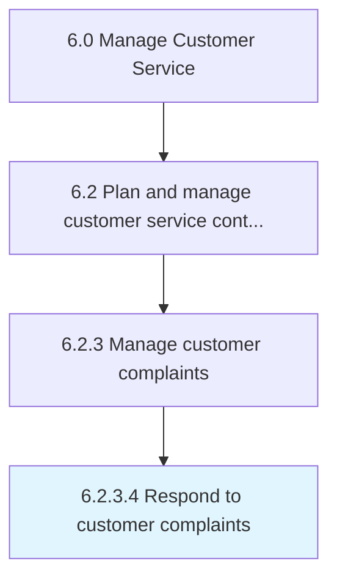

# Respond to customer complaints

> Responding to customer complaints including all activities necessitated to service any objections, complaints, or grievances with the most appropriate reply.

## Overview

Activity 6.2.3.4 is an activity within the Manage Customer Service framework. 

Responding to customer complaints including all activities necessitated to service any objections, complaints, or grievances with the most appropriate reply. Source the right information to formulate a response that eases the discomfort being experienced by the customer. (Closely coordinate with Resolve customer complaints [10399].)

## Process Hierarchy



## Key Statistics

| Metric | Value |
|--------|-------|
| APQC Code | 10400 |
| Hierarchy ID | 6.2.3.4 |
| Level | Activity |
| Parent | [6.2.3](../) |
| Sub-Processes | 0 |


## GraphDL Semantic Structure

```
respond.ToCustomerComplaints
```

| Component | Value | Description |
|-----------|-------|-------------|
| Verb | `respond` | Primary action |
| Object | `to customer complaints` | Direct object |


## Related Concepts

- CustomerComplaints


---

*Source: APQC PCF 10400 (6.2.3.4) - APQC*
