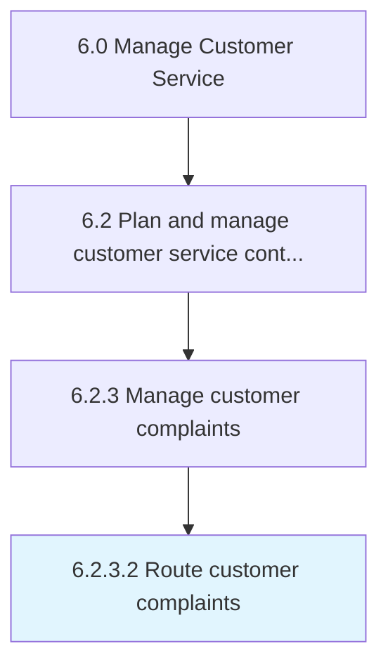

# Route customer complaints

> Routing any complaints or grievances received from customers in order to address them in the most appropriate manner.

## Overview

Activity 6.2.3.2 is an activity within the Manage Customer Service framework. 

Routing any complaints or grievances received from customers in order to address them in the most appropriate manner. Direct complaints to the best suited personnel or system. Implement a system or procedure capable of efficiently channeling the various objections, complaints, and criticism from customers over the offerings provided by the organization.

## Process Hierarchy



## Key Statistics

| Metric | Value |
|--------|-------|
| APQC Code | 10398 |
| Hierarchy ID | 6.2.3.2 |
| Level | Activity |
| Parent | [6.2.3](../) |
| Sub-Processes | 0 |


## GraphDL Semantic Structure

```
route.CustomerComplaints
```

| Component | Value | Description |
|-----------|-------|-------------|
| Verb | `route` | Primary action |
| Object | `customer complaints` | Direct object |


## Related Concepts

- [CustomerComplaints](/concepts/CustomerComplaints)


---

*Source: APQC PCF 10398 (6.2.3.2) - APQC*
