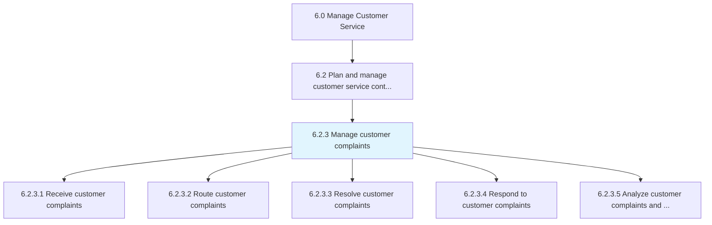
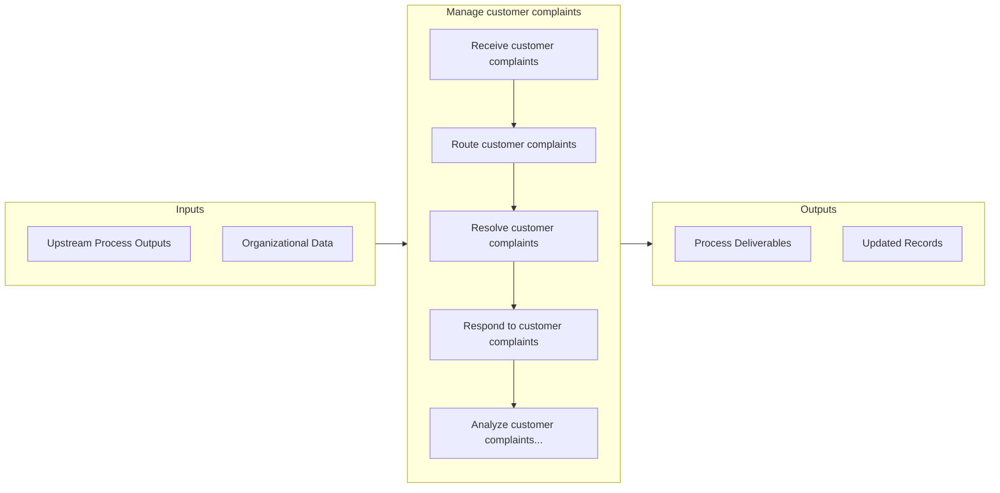

# Manage customer complaints

> Obtaining customer complaints online or by phone.

## Overview

Process 6.2.3 is a core process that defines the specific procedures for manage customer complaints. 

Obtaining customer complaints online or by phone. Direct these complaints to higher-level representatives as appropriate. Resolve them. Respond to customers.

## Process Hierarchy



## Key Statistics

| Metric | Value |
|--------|-------|
| APQC Code | 10389 |
| Hierarchy ID | 6.2.3 |
| Level | Process |
| Parent | [6.2](../) |
| Sub-Processes | 5 |


## GraphDL Semantic Structure

```
manage.CustomerComplaints
```

| Component | Value | Description |
|-----------|-------|-------------|
| Verb | `manage` | Primary action |
| Object | `customer complaints` | Direct object |


## Process Flow



## Sub-Processes

| Process | Hierarchy ID | Description |
|---------|-------------|-------------|
| [Receive customer complaints](./ReceiveCustomerComplaints) | 6.2.3.1 | Receiving any complaints or grievances from customers for the organization's products/services |
| [Route customer complaints](./RouteCustomerComplaints) | 6.2.3.2 | Routing any complaints or grievances received from customers in order to address them in the most ap |
| [Resolve customer complaints](./ResolveCustomerComplaints) | 6.2.3.3 | Resolving any customer complaints that are deemed to be sound and reasonable |
| [Respond to customer complaints](./RespondToCustomerComplaints) | 6.2.3.4 | Responding to customer complaints including all activities necessitated to service any objections, c |
| [Analyze customer complaints and response/redressal](./AnalyzeCustomerComplaintsAndResponseredressal) | 6.2.3.5 | Analyzing complaint logs to provide input for continuous service improvement and customer profiling |


## Related Concepts

- [CustomerComplaints](/concepts/CustomerComplaints)


---

*Source: APQC PCF 10389 (6.2.3) - APQC*
