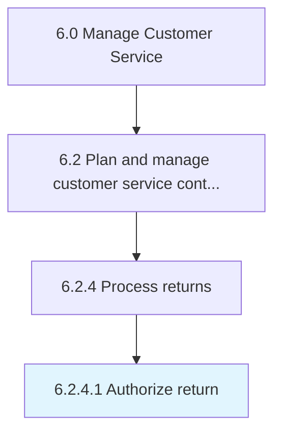

# Authorize return

> Approving and carrying forward the requests by the customers to return the product.

## Overview

Activity 6.2.4.1 is an activity within the Manage Customer Service framework. 

Approving and carrying forward the requests by the customers to return the product. This is part of the process of returning a product in order to receive a refund, replacement, or repair during the product's warranty period.

## Process Hierarchy



## Key Statistics

| Metric | Value |
|--------|-------|
| APQC Code | 10364 |
| Hierarchy ID | 6.2.4.1 |
| Level | Activity |
| Parent | [6.2.4](../) |
| Sub-Processes | 0 |


## GraphDL Semantic Structure

```
authorize.Return
```

| Component | Value | Description |
|-----------|-------|-------------|
| Verb | `authorize` | Primary action |
| Object | `return` | Direct object |


## Related Concepts

- Return


---

*Source: APQC PCF 10364 (6.2.4.1) - APQC*
