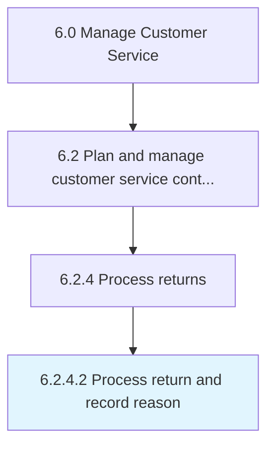

# Process return and record reason

> Notating the reason for the return of the product.

## Overview

Activity 6.2.4.2 is an activity within the Manage Customer Service framework. 

## Process Hierarchy



## Key Statistics

| Metric | Value |
|--------|-------|
| APQC Code | 20095 |
| Hierarchy ID | 6.2.4.2 |
| Level | Activity |
| Parent | [6.2.4](../) |
| Sub-Processes | 0 |


## GraphDL Semantic Structure

```
process.ReturnAndRecordReason
```

| Component | Value | Description |
|-----------|-------|-------------|
| Verb | `process` | Primary action |
| Object | `return and record reason` | Direct object |


## Related Concepts

- [ReturnReason](/concepts/ReturnReason)
- [RecordReason](/concepts/RecordReason)


---

*Source: APQC PCF 20095 (6.2.4.2) - APQC*
