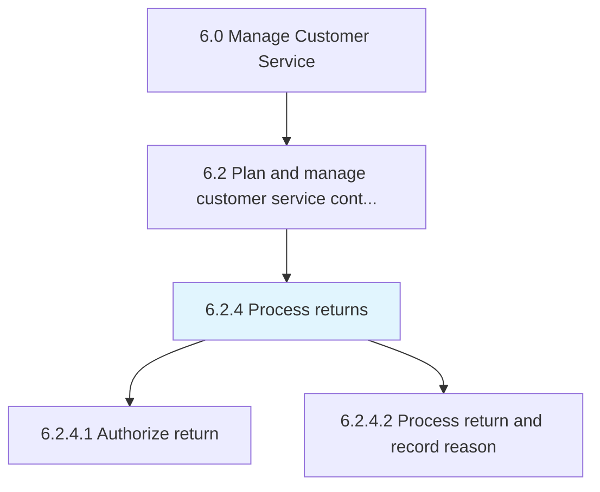
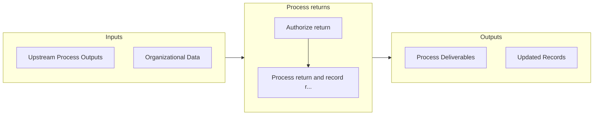

# Process returns

> Acquiring returns and identify if the returns are scraped or salvaged.

## Overview

Process 6.2.4 is a core process that defines the specific procedures for process returns. 

Acquiring returns and identify if the returns are scraped or salvaged.

## Process Hierarchy



## Key Statistics

| Metric | Value |
|--------|-------|
| APQC Code | 20094 |
| Hierarchy ID | 6.2.4 |
| Level | Process |
| Parent | [6.2](../) |
| Sub-Processes | 2 |


## GraphDL Semantic Structure

```graphdl
process.Returns
```

| Component | Value | Description |
|-----------|-------|-------------|
| Verb | `process` | Primary action |
| Object | `returns` | Direct object |


## Process Flow



## Sub-Processes

| Process | Hierarchy ID | Description |
|---------|-------------|-------------|
| [Authorize return](./AuthorizeReturn) | 6.2.4.1 | Approving and carrying forward the requests by the customers to return the product |
| [Process return and record reason](./ProcessReturnAndRecordReason) | 6.2.4.2 | Notating the reason for the return of the product |


## Related Concepts

- Returns


---

*Source: APQC PCF 20094 (6.2.4) - APQC*
