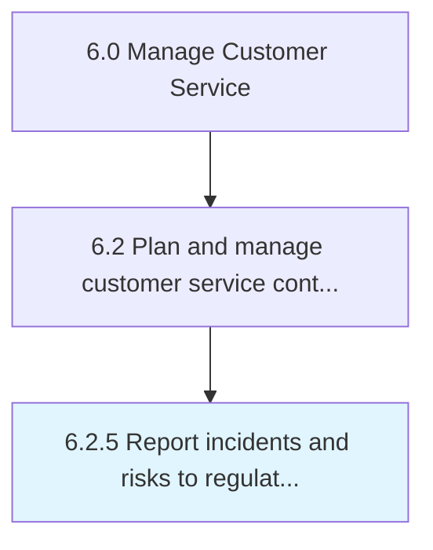
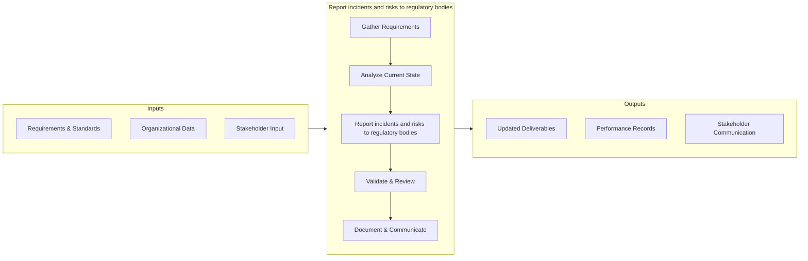

# Report incidents and risks to regulatory bodies

> Notifying all stakeholders, legal, and industry regulatory bodies of the incidents and risks related to a return or recall, if needed.

## Overview

This activity encompasses the end-to-end process of report incidents and risks to regulatory bodies within the customer service and support domain. It involves coordinating cross-functional teams, applying standardized methodologies, and leveraging organizational data to ensure consistent and effective outcomes. The process is aligned with the broader Manage Customer Service framework (APQC 6.2.5) and supports strategic objectives by translating operational requirements into actionable procedures.

Effective execution of this activity requires clear ownership, well-defined inputs and outputs, and continuous monitoring against established benchmarks. Organizations that excel at this process typically integrate it with upstream planning activities and downstream performance measurement, creating a feedback loop that drives ongoing improvement and adaptation to changing business conditions.


## Process Hierarchy



## Key Statistics

| Metric | Value |
|--------|-------|
| APQC Code | 12840 |
| Hierarchy ID | 6.2.5 |
| Level | Process |
| Parent | [6.2](../) |
| Sub-Processes | 0 |


## GraphDL Semantic Structure

```graphdl
report.IncidentsAndRisks.to.RegulatoryBodies
```

| Component | Value | Description |
|-----------|-------|-------------|
| Verb | `report` | Primary action |
| Object | `incidents and risks` | Direct object |
| Preposition | `to` | Relationship |
| PrepObject | `regulatory bodies` | Indirect object |


## Process Flow



## RACI Matrix

| Activity | Customer Service Manager | CX Director | Quality Assurance Team | IT Support |
|----------|:-:|:-:|:-:|:-:|
| Gather Requirements | R | A | C | I |
| Analyze Current State | R | I | C | I |
| Report incidents and risks to regulatory bodies | R | A | C | I |
| Validate & Review | C | A | R | I |
| Document & Communicate | R | I | I | C |

## Related Occupations

- [Customer Service Manager](/occupations/CustomerServiceManagers)
- [Contact Center Supervisor](/occupations/ContactCenterSupervisors)
- [Customer Experience Analyst](/occupations/CustomerExperienceAnalysts)
- [Technical Support Specialist](/occupations/TechnicalSupportSpecialists)

## Related Departments

- Customer Service & Support
- Customer Experience
- Quality Assurance

## Industry Variations

### Telecommunications
High-volume contact centers with emphasis on first-call resolution, churn prevention, and technical troubleshooting escalation paths.

### E-Commerce
Focus on self-service capabilities, returns management, and real-time chat support with AI-assisted triage.

### Banking & Financial Services
Emphasis on regulatory compliance in complaint handling, fraud resolution workflows, and omnichannel service delivery.

## KPIs & Metrics

| KPI | Description | Unit |
|-----|-------------|------|
| Cycle Time | Average time to complete report incidents and risks process | Hours/Days |
| Completion Rate | Percentage of incidents and risks activities completed on schedule | % |
| Quality Score | Accuracy and quality rating of incidents and risks outputs | 1-10 Scale |
| Cost Efficiency | Cost per unit of incidents and risks processed | $/Unit |
| Customer Satisfaction (CSAT) | Customer rating of the incidents and risks experience | 1-5 Scale |

## Related Concepts

- Incidents
- RegulatoryBodies
- Risks
- RegulatoryBodies


---

*Source: APQC PCF 12840 (6.2.5) - APQC*
