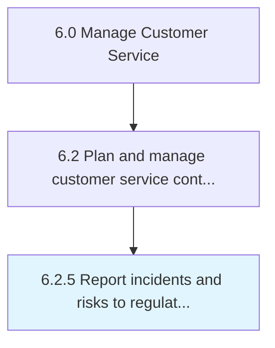

# Report incidents and risks to regulatory bodies

> Notifying all stakeholders, legal, and industry regulatory bodies of the incidents and risks related to a return or recall, if needed.

## Overview

Process 6.2.5 is a core process that defines the specific procedures for report incidents and risks to regulatory bodies. 

Notifying all stakeholders, legal, and industry regulatory bodies of the incidents and risks related to a return or recall, if needed.

## Process Hierarchy



## Key Statistics

| Metric | Value |
|--------|-------|
| APQC Code | 12840 |
| Hierarchy ID | 6.2.5 |
| Level | Process |
| Parent | [6.2](../) |
| Sub-Processes | 0 |


## GraphDL Semantic Structure

```
report.IncidentsAndRisks.to.RegulatoryBodies
```

| Component | Value | Description |
|-----------|-------|-------------|
| Verb | `report` | Primary action |
| Object | `incidents and risks` | Direct object |
| Preposition | `to` | Relationship |
| PrepObject | `regulatory bodies` | Indirect object |


## Related Concepts

- [Incidents](/concepts/Incidents)
- [RegulatoryBodies](/concepts/RegulatoryBodies)
- [Risks](/concepts/Risks)
- [RegulatoryBodies](/concepts/RegulatoryBodies)


---

*Source: APQC PCF 12840 (6.2.5) - APQC*
