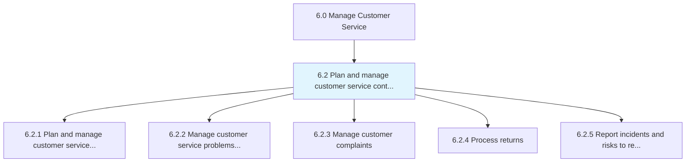
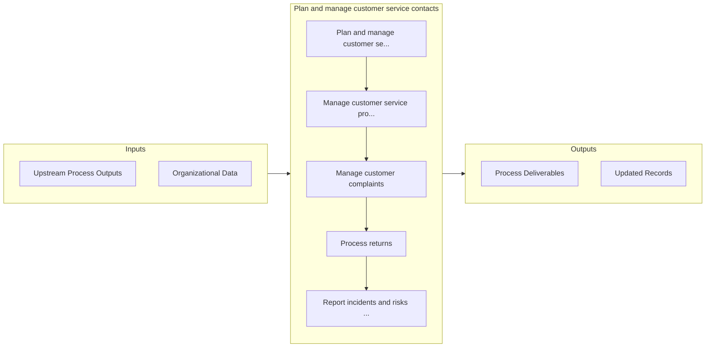

# Plan and manage customer service contacts

> Planning and administering work force operations for customer service provision by taking care of customer services requests/inquiries, as well as the complaints.

## Overview

Group 6.2 is a process group within APQC Category 6.0 (Manage Customer Service). 

Planning and administering work force operations for customer service provision by taking care of customer services requests/inquiries, as well as the complaints.

## Process Hierarchy



## Key Statistics

| Metric | Value |
|--------|-------|
| APQC Code | 10379 |
| Hierarchy ID | 6.2 |
| Level | Group |
| Parent | [6](../) |
| Sub-Processes | 5 |


## GraphDL Semantic Structure

```
plan.AndManageCustomerServiceContacts
```

| Component | Value | Description |
|-----------|-------|-------------|
| Verb | `plan` | Primary action |
| Object | `and manage customer service contacts` | Direct object |


## Process Flow



## Sub-Processes

| Process | Hierarchy ID | Description |
|---------|-------------|-------------|
| [Plan and manage customer service work force](./6.2.1-PlanManageCustomerService/) | 6.2.1 | Creating and administering the work force deployed for the customer service process |
| [Manage customer service problems, requests, and inquiries](./6.2.2-ManageCustomerServiceProblems/) | 6.2.2 | Handling the requests and inquiries from customers that seek information regarding the organization' |
| [Manage customer complaints](./6.2.3-ManageCustomerComplaints/) | 6.2.3 | Obtaining customer complaints online or by phone |
| [Process returns](./6.2.4-ProcessReturns/) | 6.2.4 | Acquiring returns and identify if the returns are scraped or salvaged |
| [Report incidents and risks to regulatory bodies](./ReportIncidentsAndRisksToRegulatoryBodies) | 6.2.5 | Notifying all stakeholders, legal, and industry regulatory bodies of the incidents and risks related |


## Related Concepts

- [CustomerServiceContacts](/concepts/CustomerServiceContacts)
- [CustomerServiceContacts](/concepts/CustomerServiceContacts)


---

*Source: APQC PCF 10379 (6.2) - APQC*
