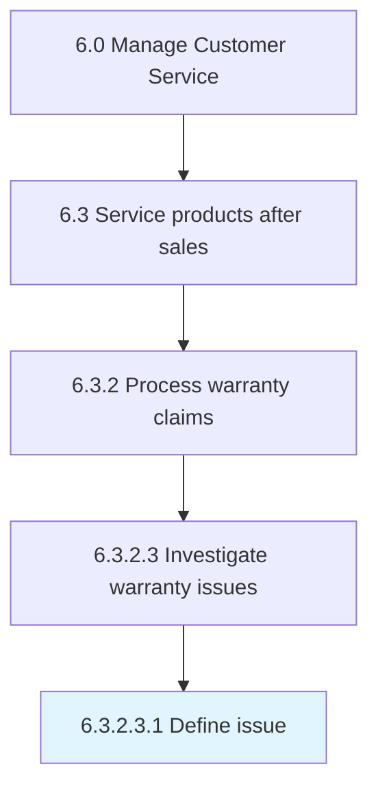

# Define issue

> Defining the issue of the claim.

## Overview

Sub-Activity 6.3.2.3.1 is an activity within the Manage Customer Service framework. 

Defining the issue of the claim. The warranty team will look into the issue and understand whether it is covered by the claim code or if more detail is required. Field service will be scheduled to further qualify the definition of the issue and to collect more evidence.

## Process Hierarchy



## Key Statistics

| Metric | Value |
|--------|-------|
| APQC Code | 20098 |
| Hierarchy ID | 6.3.2.3.1 |
| Level | Sub-Activity |
| Parent | [6.3.2.3](../) |
| Sub-Processes | 0 |


## GraphDL Semantic Structure

```
define.Issue
```

| Component | Value | Description |
|-----------|-------|-------------|
| Verb | `define` | Primary action |
| Object | `issue` | Direct object |


## Related Concepts

- [Issue](/concepts/Issue)


---

*Source: APQC PCF 20098 (6.3.2.3.1) - APQC*
