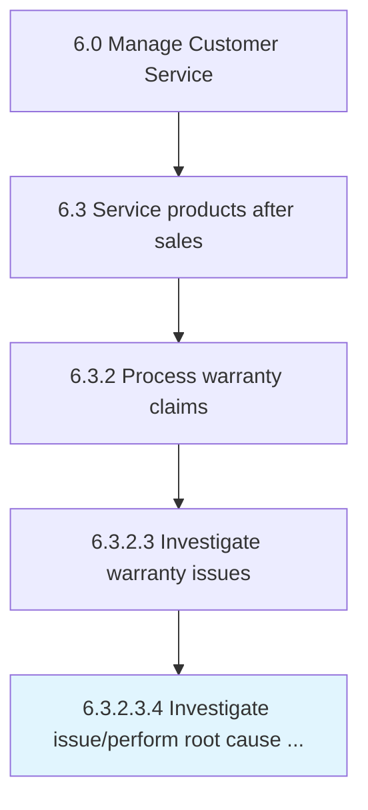

# Investigate issue/perform root cause analysis

> Investigating claims by an appropriate functional representative.

## Overview

Sub-Activity 6.3.2.3.4 is an activity within the Manage Customer Service framework. 

Investigating claims by an appropriate functional representative. Once the issue has been clearly defined and diagnosed and a recommendation for corrective action is determined, it will be provided to the warranty management team.

## Process Hierarchy



## Key Statistics

| Metric | Value |
|--------|-------|
| APQC Code | 20099 |
| Hierarchy ID | 6.3.2.3.4 |
| Level | Sub-Activity |
| Parent | [6.3.2.3](../) |
| Sub-Processes | 0 |


## GraphDL Semantic Structure

```
investigate.IssueperformRootCauseAnalysis
```

| Component | Value | Description |
|-----------|-------|-------------|
| Verb | `investigate` | Primary action |
| Object | `issue/perform root cause analysis` | Direct object |


## Related Concepts

- [IssueRootCauseAnalysis](/concepts/IssueRootCauseAnalysis)
- [PerformRootCauseAnalysis](/concepts/PerformRootCauseAnalysis)


---

*Source: APQC PCF 20099 (6.3.2.3.4) - APQC*
