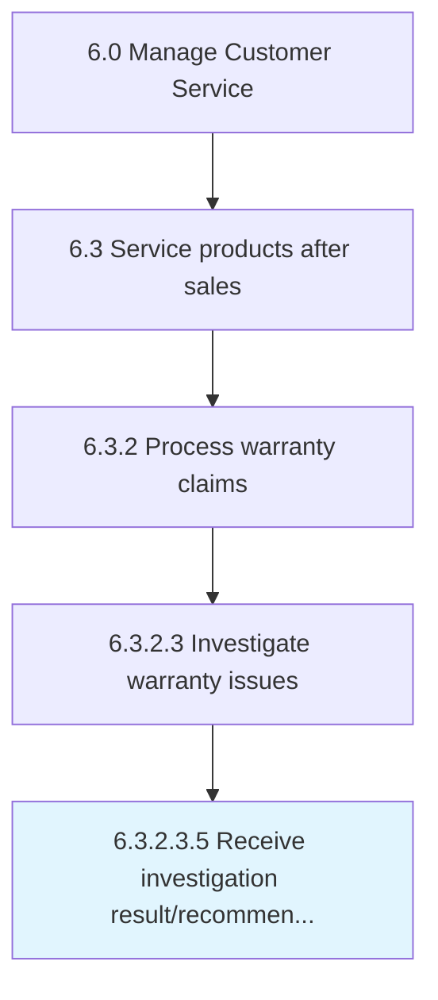

# Receive investigation result/recommendation for corrective action

> Receiving investigative results to assess claim approval or denial.

## Overview

Sub-Activity 6.3.2.3.5 is an activity within the Manage Customer Service framework. 

Receiving investigative results to assess claim approval or denial. The warranty team will assess the results of the investigation and the recommendations for corrective action.

## Process Hierarchy



## Key Statistics

| Metric | Value |
|--------|-------|
| APQC Code | 20100 |
| Hierarchy ID | 6.3.2.3.5 |
| Level | Sub-Activity |
| Parent | [6.3.2.3](../) |
| Sub-Processes | 0 |


## GraphDL Semantic Structure

```
receive.InvestigationResultrecommendation.for.CorrectiveAction
```

| Component | Value | Description |
|-----------|-------|-------------|
| Verb | `receive` | Primary action |
| Object | `investigation result/recommendation` | Direct object |
| Preposition | `for` | Relationship |
| PrepObject | `corrective action` | Indirect object |


## Related Concepts

- InvestigationResult
- CorrectiveAction
- InvestigationRecommendation
- CorrectiveAction


---

*Source: APQC PCF 20100 (6.3.2.3.5) - APQC*
