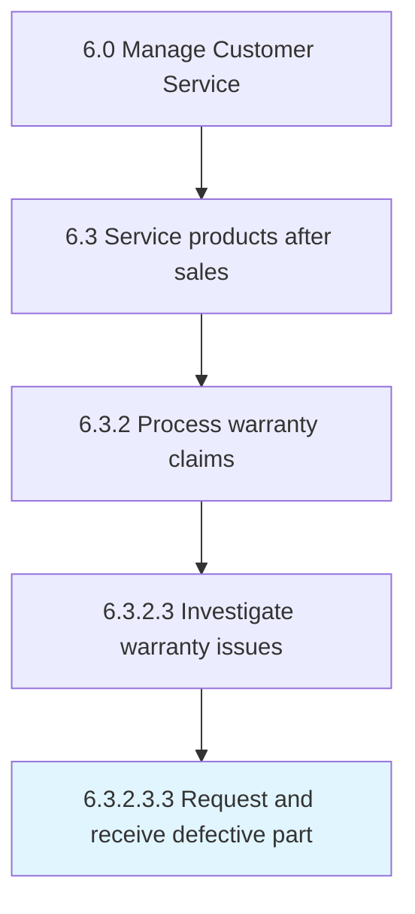

# Request and receive defective part

> Requesting receipt of a defective part for further investigation.

## Overview

Sub-Activity 6.3.2.3.3 is an activity within the Manage Customer Service framework. 

Requesting receipt of a defective part for further investigation.

## Process Hierarchy



## Key Statistics

| Metric | Value |
|--------|-------|
| APQC Code | 12678 |
| Hierarchy ID | 6.3.2.3.3 |
| Level | Sub-Activity |
| Parent | [6.3.2.3](../) |
| Sub-Processes | 0 |


## GraphDL Semantic Structure

```
request.AndReceiveDefectivePart
```

| Component | Value | Description |
|-----------|-------|-------------|
| Verb | `request` | Primary action |
| Object | `and receive defective part` | Direct object |


## Related Concepts

- [DefectivePart](/concepts/DefectivePart)
- [DefectivePart](/concepts/DefectivePart)


---

*Source: APQC PCF 12678 (6.3.2.3.3) - APQC*
