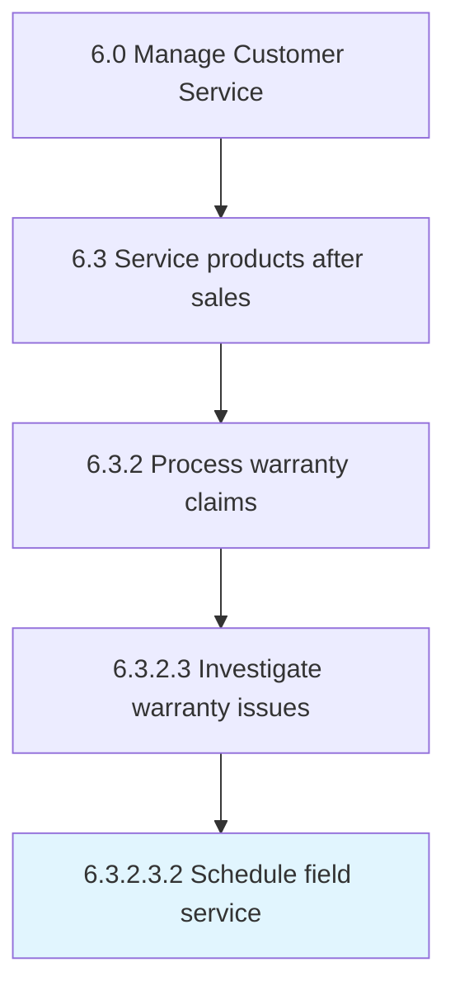

# Schedule field service

> Scheduling additional investigative field service.

## Overview

Sub-Activity 6.3.2.3.2 is an activity within the Manage Customer Service framework. 

Scheduling additional investigative field service. This is performed for high priority claims or claims that require additional investigation. Field service engineers will gather additional information, perform further investigation, and qualify the definition of the issue.

## Process Hierarchy



## Key Statistics

| Metric | Value |
|--------|-------|
| APQC Code | 12677 |
| Hierarchy ID | 6.3.2.3.2 |
| Level | Sub-Activity |
| Parent | [6.3.2.3](../) |
| Sub-Processes | 0 |


## GraphDL Semantic Structure

```
schedule.FieldService
```

| Component | Value | Description |
|-----------|-------|-------------|
| Verb | `schedule` | Primary action |
| Object | `field service` | Direct object |


## Related Concepts

- FieldService


---

*Source: APQC PCF 12677 (6.3.2.3.2) - APQC*
