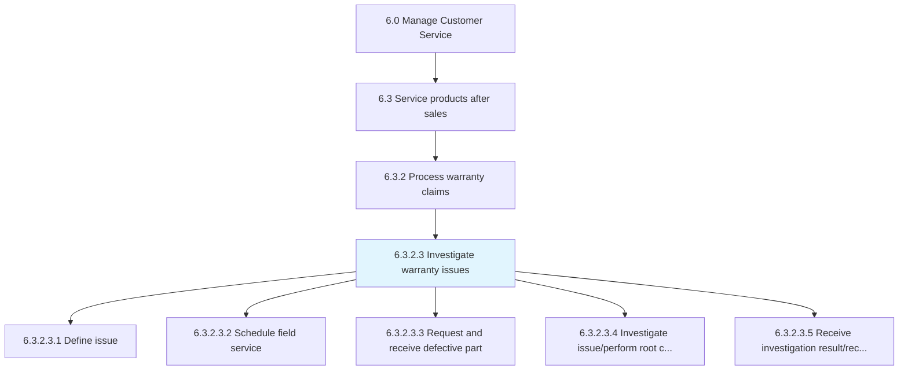
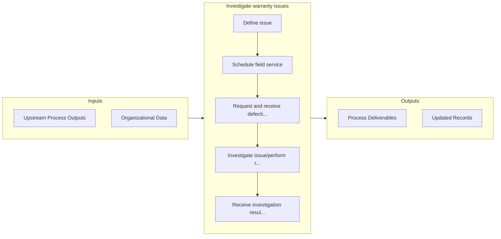

# Investigate warranty issues

> Executing investigational and analysis of warranty claims.

## Overview

Activity 6.3.2.3 is an activity within the Manage Customer Service framework. 

Executing investigational and analysis of warranty claims. This involves notification and definition of a warranty issue, includes the scheduling of a field service agent to perform further investigation; the request and receipt of defective parts; and diagnosis/root cause analysis. This concludes with the receipt of the result and recommendation for corrective action.

## Process Hierarchy



## Key Statistics

| Metric | Value |
|--------|-------|
| APQC Code | 20097 |
| Hierarchy ID | 6.3.2.3 |
| Level | Activity |
| Parent | [6.3.2](../) |
| Sub-Processes | 5 |


## GraphDL Semantic Structure

```graphdl
investigate.WarrantyIssues
```

| Component | Value | Description |
|-----------|-------|-------------|
| Verb | `investigate` | Primary action |
| Object | `warranty issues` | Direct object |


## Process Flow



## Sub-Processes

| Process | Hierarchy ID | Description |
|---------|-------------|-------------|
| [Define issue](./DefineIssue) | 6.3.2.3.1 | Defining the issue of the claim |
| [Schedule field service](./ScheduleFieldService) | 6.3.2.3.2 | Scheduling additional investigative field service |
| [Request and receive defective part](./RequestAndReceiveDefectivePart) | 6.3.2.3.3 | Requesting receipt of a defective part for further investigation |
| [Investigate issue/perform root cause analysis](./InvestigateIssueperformRootCauseAnalysis) | 6.3.2.3.4 | Investigating claims by an appropriate functional representative |
| [Receive investigation result/recommendation for corrective action](./ReceiveInvestigationResultrecommendationForCorrectiveAction) | 6.3.2.3.5 | Receiving investigative results to assess claim approval or denial |


## Related Concepts

- WarrantyIssues


---

*Source: APQC PCF 20097 (6.3.2.3) - APQC*
