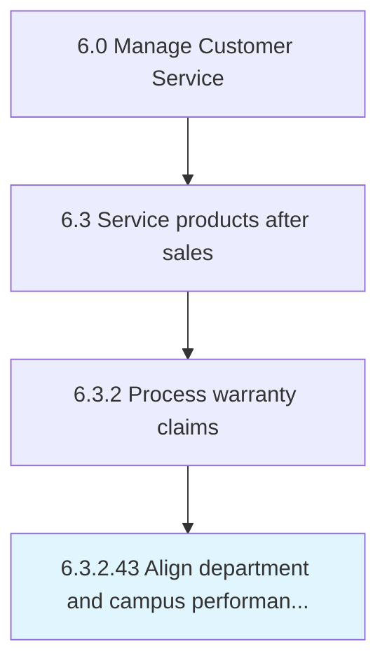

# Align department and campus performance measures to district level measures

## Overview

Activity 6.3.2.43 is an activity within the Manage Customer Service framework. 

## Process Hierarchy



## Key Statistics

| Metric | Value |
|--------|-------|
| APQC Code | 19984 |
| Hierarchy ID | 6.3.2.43 |
| Level | Activity |
| Parent | [6.3.2](../) |
| Sub-Processes | 0 |


## GraphDL Semantic Structure

```
align.DepartmentAndCampusPerformanceMeasures.to.DistrictLevelMeasures
```

| Component | Value | Description |
|-----------|-------|-------------|
| Verb | `align` | Primary action |
| Object | `department and campus performance measures` | Direct object |
| Preposition | `to` | Relationship |
| PrepObject | `district level measures` | Indirect object |


---

*Source: APQC PCF 19984 (6.3.2.43) - APQC*
