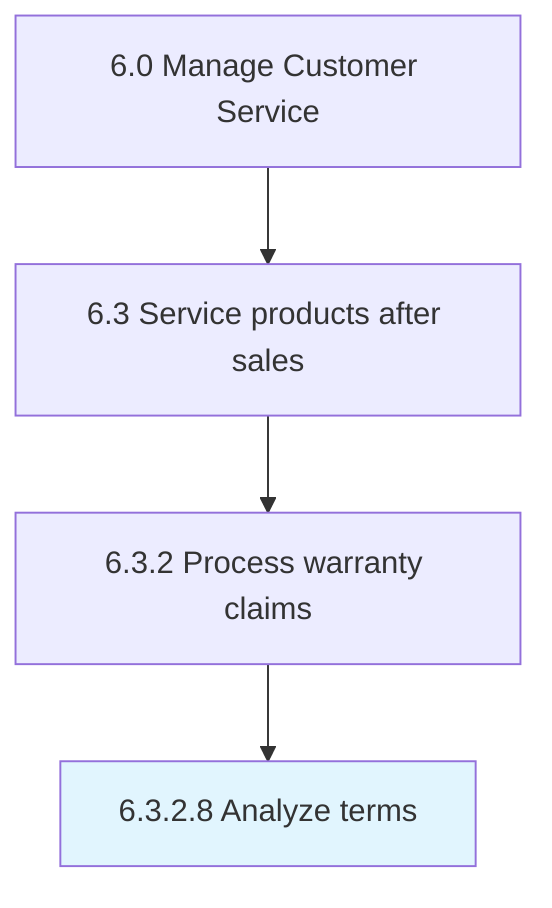

# Analyze terms

## Overview

Activity 6.3.2.8 is an activity within the Manage Customer Service framework. 

## Process Hierarchy



## Key Statistics

| Metric | Value |
|--------|-------|
| APQC Code | 13272 |
| Hierarchy ID | 6.3.2.8 |
| Level | Activity |
| Parent | [6.3.2](../) |
| Sub-Processes | 0 |


## GraphDL Semantic Structure

```
analyze.Terms
```

| Component | Value | Description |
|-----------|-------|-------------|
| Verb | `analyze` | Primary action |
| Object | `terms` | Direct object |


---

*Source: APQC PCF 13272 (6.3.2.8) - APQC*
