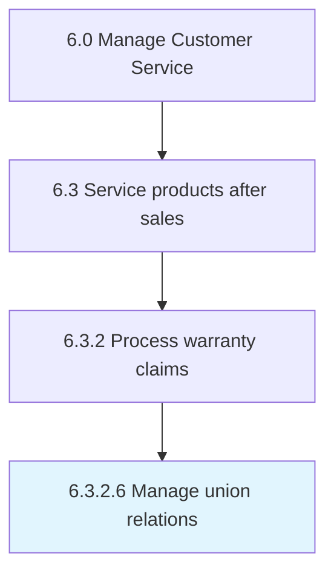

# Approve or reject warranty claim

> Following Defining issue [20098], an approval or rejection with be made against the warranty claim.

## Overview

Activity 6.3.2.6 is an activity within the Manage Customer Service framework. 

Following Defining issue [20098], an approval or rejection with be made against the warranty claim. If it is deemed that the claim falls within the warranty parameters, the claim will be approved. If the claim is deemed to fall outside warranty parameters, the claim with be rejected.

## Process Hierarchy



## Key Statistics

| Metric | Value |
|--------|-------|
| APQC Code | 12668 |
| Hierarchy ID | 6.3.2.6 |
| Level | Activity |
| Parent | [6.3.2](../) |
| Sub-Processes | 0 |


## GraphDL Semantic Structure

```
approve.OrRejectWarrantyClaim
```

| Component | Value | Description |
|-----------|-------|-------------|
| Verb | `approve` | Primary action |
| Object | `or reject warranty claim` | Direct object |


---

*Source: APQC PCF 12668 (6.3.2.6) - APQC*
