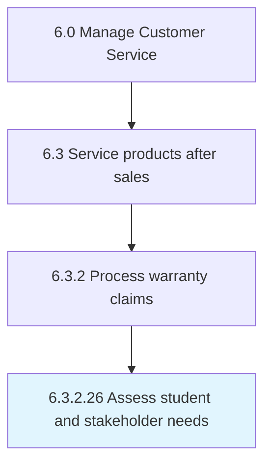

# Assess student and stakeholder needs

## Overview

Activity 6.3.2.26 is an activity within the Manage Customer Service framework. 

## Process Hierarchy



## Key Statistics

| Metric | Value |
|--------|-------|
| APQC Code | 19947 |
| Hierarchy ID | 6.3.2.26 |
| Level | Activity |
| Parent | [6.3.2](../) |
| Sub-Processes | 0 |


## GraphDL Semantic Structure

```
assess.StudentAndStakeholderNeeds
```

| Component | Value | Description |
|-----------|-------|-------------|
| Verb | `assess` | Primary action |
| Object | `student and stakeholder needs` | Direct object |


---

*Source: APQC PCF 19947 (6.3.2.26) - APQC*
