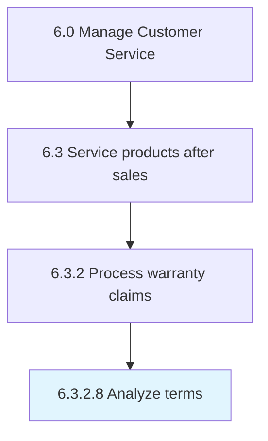

# Authorize payment

> Allowing for a payment to be made to the claimant.

## Overview

Activity 6.3.2.8 is an activity within the Manage Customer Service framework. 

## Process Hierarchy



## Key Statistics

| Metric | Value |
|--------|-------|
| APQC Code | 20104 |
| Hierarchy ID | 6.3.2.8 |
| Level | Activity |
| Parent | [6.3.2](../) |
| Sub-Processes | 0 |


## GraphDL Semantic Structure

```
authorize.Payment
```

| Component | Value | Description |
|-----------|-------|-------------|
| Verb | `authorize` | Primary action |
| Object | `payment` | Direct object |


---

*Source: APQC PCF 20104 (6.3.2.8) - APQC*
