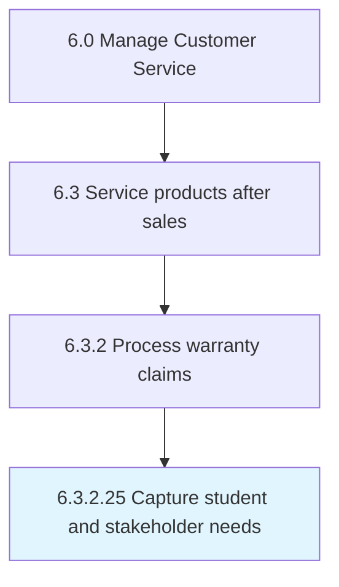

# Capture student and stakeholder needs

## Overview

Activity 6.3.2.25 is an activity within the Manage Customer Service framework. 

## Process Hierarchy



## Key Statistics

| Metric | Value |
|--------|-------|
| APQC Code | 19946 |
| Hierarchy ID | 6.3.2.25 |
| Level | Activity |
| Parent | [6.3.2](../) |
| Sub-Processes | 0 |


## GraphDL Semantic Structure

```
capture.StudentAndStakeholderNeeds
```

| Component | Value | Description |
|-----------|-------|-------------|
| Verb | `capture` | Primary action |
| Object | `student and stakeholder needs` | Direct object |


---

*Source: APQC PCF 19946 (6.3.2.25) - APQC*
