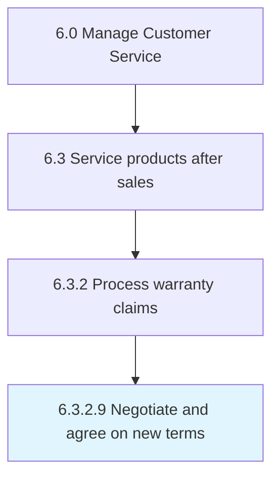

# Close claim

> Archiving and closing the warranty claim after a final decision has been made to either approve or reject.

## Overview

Activity 6.3.2.9 is an activity within the Manage Customer Service framework. 

Archiving and closing the warranty claim after a final decision has been made to either approve or reject.

## Process Hierarchy



## Key Statistics

| Metric | Value |
|--------|-------|
| APQC Code | 20105 |
| Hierarchy ID | 6.3.2.9 |
| Level | Activity |
| Parent | [6.3.2](../) |
| Sub-Processes | 0 |


## GraphDL Semantic Structure

```
close.Claim
```

| Component | Value | Description |
|-----------|-------|-------------|
| Verb | `close` | Primary action |
| Object | `claim` | Direct object |


---

*Source: APQC PCF 20105 (6.3.2.9) - APQC*
