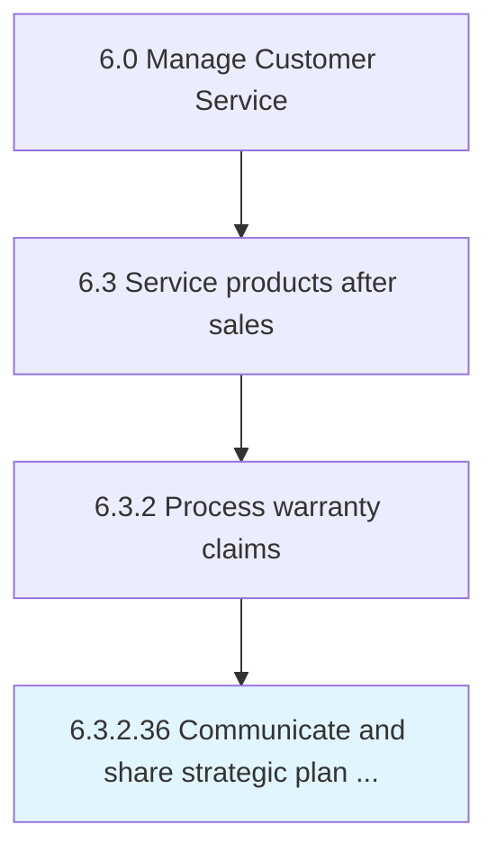

# Communicate and share strategic plan with all staff

## Overview

Activity 6.3.2.36 is an activity within the Manage Customer Service framework. 

## Process Hierarchy



## Key Statistics

| Metric | Value |
|--------|-------|
| APQC Code | 20189 |
| Hierarchy ID | 6.3.2.36 |
| Level | Activity |
| Parent | [6.3.2](../) |
| Sub-Processes | 0 |


## GraphDL Semantic Structure

```
communicate.AndShareStrategicPlan.with.AllStaff
```

| Component | Value | Description |
|-----------|-------|-------------|
| Verb | `communicate` | Primary action |
| Object | `and share strategic plan` | Direct object |
| Preposition | `with` | Relationship |
| PrepObject | `all staff` | Indirect object |


---

*Source: APQC PCF 20189 (6.3.2.36) - APQC*
